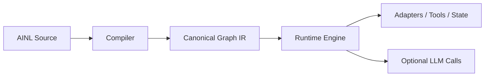

# AI Native Lang (AINL)

> AI-led co-development project, human-initiated by Steven Hooley (`x.com/sbhooley`, `stevenhooley.com`, `linkedin.com/in/sbhooley`). Attribution details: `docs/PROJECT_ORIGIN_AND_ATTRIBUTION.md` and `tooling/project_provenance.json`.

AI Native Lang (AINL) is a compact language and toolchain for agent-oriented workflows. The compiler emits canonical graph IR and compatibility `legacy.steps`; the runtime executes graph-first semantics through `runtime/engine.py`.

AINL is best understood as a **graph-canonical intermediate programming system** with:
- a compact textual surface for generation and transport,
- a compiler/runtime pair designed around deterministic IR,
- emitters for practical targets,
- and tooling for constrained decoding, diffing, patching, and evaluation.

The repository also includes advanced, noncanonical extension surfaces for operator-oriented workflows, but those are not the core/safe-default entry point.

## In Plain English

AINL helps turn AI from “a smart conversation” into “a structured worker.”

It is designed for teams building AI workflows that need:
- multiple steps
- state and memory
- tool use
- repeatable execution
- validation and control
- lower dependence on long prompt loops

## Who AINL Is For

AINL is best suited for:

- AI engineers and agent builders
- teams building internal AI workers and structured automations
- platform and ops teams that need controlled AI workflows
- enterprises that care about repeatability, auditability, and workflow governance

AINL is less optimized for:
- casual chatbot prototyping
- one-off prompt hacks
- no-code-first usage

## Why AINL Exists

AINL (AI Native Lang) is a graph-first, AI-oriented programming system designed for a specific problem:

Modern AI systems are increasingly powerful at reasoning, but still unreliable and expensive when forced to orchestrate whole workflows through long prompt loops.

AINL addresses that by moving orchestration out of the model and into a deterministic execution substrate.

Instead of asking an LLM to repeatedly plan, remember prior tool calls, and carry growing state through a chat transcript, AINL lets agents produce a compact workflow program that compiles into a canonical graph IR and runs through a controlled runtime with adapters.

In practice, that means:

- The model describes the workflow once
- The compiler validates it
- The runtime executes it deterministically
- State lives in variables, cache, memory, databases, and adapters — not in prompt history

## The Core Idea

AINL is built around one invariant:

> **Canonical IR = nodes + edges; everything else is serialization.**

AINL source is a compact surface language for producing the canonical graph.
That graph can then be:

- Executed by the runtime
- Inspected and diffed
- Validated in strict mode
- Emitted into other targets such as:
  - FastAPI
  - React/TypeScript
  - Prisma
  - OpenAPI
  - Docker / Compose
  - Cron / queue / scraper / MT5 outputs

This makes AINL both a workflow language and a canonical intermediate representation for AI-generated systems.

## Why Businesses Care

AINL matters when AI moves beyond demos and starts doing real operational work.

It is especially useful when teams need AI workflows that are:

- repeatable
- inspectable
- stateful
- tool-using
- cost-aware
- easier to validate and maintain

AINL helps reduce the gap between “a clever AI demo” and “a workflow a business can actually run.”

## Why This Matters for AI Agents

Large language models are pushing toward ever larger context windows, but long context alone is not a sufficient systems design strategy.

Long prompt loops create familiar problems:

- Prompt bloat
- Rising token cost
- Hidden state
- Brittle orchestration
- Poor auditability
- Hard-to-debug tool behavior

AINL solves this at the programming layer.

An AINL program gives an agent:

- Explicit control flow
- Explicit side effects
- Compile-time validation
- Capability-aware boundaries
- Externalized memory
- Reproducible runtime behavior

The LLM stops being the whole control plane and becomes a reasoning component inside a deterministic system.

## What Makes AINL Different

### 1. Graph-first, not prompt-first

AINL programs compile to canonical graph IR. Execution follows graph semantics, not ad hoc conversational state.

### 2. AI-oriented surface syntax

The surface language is intentionally compact and structured for parseability, determinism, and low-entropy generation by models.

### 3. Strict-mode guarantees

AINL’s strict mode enforces high-value invariants such as:

- Canonical graph emission
- No undeclared references
- No unknown module operations
- Adapter arity validation
- No unreachable or duplicate nodes
- Canonical node IDs
- Validated call returns
- Controlled exits

### 4. Adapters separate “what” from “how”

AINL describes what should happen.
Adapters implement how it happens.

This allows the same graph language to drive:

- HTTP
- SQLite
- Filesystem operations
- Email/calendar/social integrations
- Service checks
- Cache/memory
- Queues
- WASM modules
- OpenClaw-specific operational workflows

### 5. Multi-target leverage

One AINL program can describe a workflow once and emit multiple downstream artifacts, rather than forcing an agent to regenerate parallel implementations across backend, frontend, schema, and deployment surfaces.

## Apollo + OpenClaw: A Real Operational Use Case

AINL is not just a speculative language design. It is already used in live OpenClaw-integrated workflows.

The Apollo / OpenClaw stack exercises adapters such as:

- `email`
- `calendar`
- `social`
- `db`
- `svc`
- `cache`
- `queue`
- `wasm`
- `memory`
- `extras`
- `tiktok`

Production-validated examples include:

- `demo/monitor_system.lang`
- Daily digest workflows
- Infrastructure watchdogs
- Lead enrichment
- Token cost tracking
- TikTok SLA monitoring
- Canary probes
- Memory pruning
- Session continuity
- Meta-monitoring of the monitor fleet itself

These programs demonstrate that AINL is effective not only for toy examples, but for:

- Recurring monitors
- Stateful automation
- Autonomous ops
- Safety-aware tool orchestration
- Long-lived agent systems

## Token Efficiency: What We Can Honestly Say

AINL’s compactness and cost benefits should be described carefully.

In production-oriented workflows, we found that AINL can materially reduce token usage compared to generating equivalent Python/TypeScript directly with an LLM.

- **Token Cost Efficiency:** AINL can save tokens in two ways. First, at authoring time, because the DSL is denser than general-purpose code. Second, at runtime, because compiled AINL programs execute deterministically through adapters and do not require recurring model inference on each execution. In practice, this can significantly reduce prompt and code-generation volume for non-trivial workflows while also eliminating repeated model-generation cost during normal operation. Complex monitors and similar programs that take roughly 30k–70k tokens in AINL (including the program itself and relevant runtime context) are estimated to require 3–5× more tokens, depending on workload, when generated as equivalent Python or TypeScript by an LLM. Those equivalents would also typically lack AINL’s strict validation, graph introspection, and multi-target emission. After the initial learning curve, AINL is estimated to reduce per-task token burn by 2–5× for non-trivial automation. For simple tasks, the savings are smaller but still generally positive due to DSL density.

Bottom line: AINL lowers overall token usage while increasing capability, predictability, and reliability.

**What is supported today:**

- AINL is often denser than equivalent generated implementation artifacts
- The benchmark is profile-scoped and mode-scoped
- Minimal emit is the more honest deployment comparison
- Full multitarget is best understood as downstream expansion leverage, not apples-to-apples terseness
- Compile-once / run-many workflows reduce repeated model-generation cost

**What is not supported:**

- Universal compactness claims against all mainstream languages
- Guaranteed tokenizer pricing savings from lexical proxy metrics alone

**Current benchmark framing:**

- `canonical_strict_valid` is the primary headline profile
- `approx_chunks` is a lexical-size proxy, not a tokenizer-billing metric
- In `full_multitarget`, canonical strict examples show strong expansion leverage
- In `minimal_emit`, mixed compatibility examples can be smaller or larger depending on artifact class and required targets

This means the strongest truthful claim is:

> AINL provides a compact, reproducible, profile-segmented way to express graph workflows and multi-target systems, while often reducing repeated AI generation effort and avoiding repeated orchestration token burn during runtime.

## Where AINL Helps Most

AINL is most valuable when workflows are:

- Recurring
- Stateful
- Branching
- Safety-sensitive
- Multi-step
- Multi-target
- Shared across teams or agents

That is where its graph structure, policies, adapters, and oversight deliver the most leverage.

For trivial one-off scripts, the gain is smaller.
For multi-step agent systems and autonomous operational workflows, the gain can be substantial.

## The Design Philosophy

AINL is built on a simple systems view:

LLMs are good at reasoning, compression, and synthesis.
They are not the ideal substrate for persistent orchestration, audit trails, state handling, or deterministic workflow control.

So AINL gives AI systems a native substrate for those concerns.

The result is a different architecture:



The graph is the source of truth. The runtime is the orchestrator. The model is a bounded reasoning component inside the system.

### In One Sentence

> AINL is a compact, graph-canonical, AI-native programming system for building deterministic workflows, multi-target applications, and operational agents without relying on ever-growing prompt loops.

## Competitive Landscape

AINL sits at the intersection of:

- graph-native agent orchestration
- deterministic workflow execution
- AI-native programming languages

Several systems validate parts of this direction:

| System | Focus | Difference vs AINL |
|--------|------|-------------------|
| LangGraph | Graph-based agent orchestration | No canonical IR or compiler layer |
| Temporal | Durable workflow execution | Not AI-native, no DSL or emitters |
| Restate | Durable agents & services | Runtime-focused, no language layer |
| Microsoft Agent Framework | Typed graph workflows | Framework, not a compiled language |
| AutoGen | Multi-agent coordination | Prompt/event-driven, not deterministic graphs |

AINL uniquely combines:

- graph-first canonical IR
- strict validation & conformance
- adapter-based effect system
- compile-once, run-many execution
- multi-target emission (API, UI, DB, infra)

→ Treating AI systems as **deterministic programs**, not prompt loops.

## Status

AI Native Lang is an actively developed open-core project. The core compiler/runtime and graph tooling are real and usable; some language surfaces, examples, targets, and evaluation workflows are still being stabilized.

Public release expectations:
- the **graph-first compiler/runtime core** is the most stable part of the project,
- **server/OpenAPI/runtime/tooling** are the strongest current implementation lanes,
- some examples and compatibility artifacts are intentionally classified as non-strict or legacy,
- broad target coverage exists, but not every target is equally mature or equally validated.

For implementation and shipped-capability status, see:

- [docs/CONFORMANCE.md](docs/CONFORMANCE.md)
- [docs/RELEASE_READINESS.md](docs/RELEASE_READINESS.md)
- [docs/runtime/TARGETS_ROADMAP.md](docs/runtime/TARGETS_ROADMAP.md)
- [docs/AINL_CANONICAL_CORE.md](docs/AINL_CANONICAL_CORE.md)
- [docs/EXAMPLE_SUPPORT_MATRIX.md](docs/EXAMPLE_SUPPORT_MATRIX.md)
- [docs/advanced/SAFE_USE_AND_THREAT_MODEL.md](docs/advanced/SAFE_USE_AND_THREAT_MODEL.md)

## What AINL Is

AINL is not just "short syntax for prompts" and it is not yet trying to compete head-on with general-purpose human languages.

Today, the project is strongest as:
- an AI-oriented programming representation with canonical graph IR,
- a compiler front-end into multiple practical targets,
- a runtime for graph-executed workflows,
- and a training/evaluation surface for structured code generation systems.

## Standardized Health Envelope

All production monitors use a common message envelope for notifications:

```json
{
  "envelope": {"version":"1.0","generated_at":"<ISO>"},
  "module": "<monitor_name>",
  "status": "ok" | "alert",
  "ts": "<ISO>",
  "metrics": { ... },
  "history_24h": { ... },
  "meta": {}
}
```

This ensures consistent parsing for Telegram, dashboards, and downstream processing. See [`docs/operations/STANDARDIZED_HEALTH_ENVELOPE.md`](docs/operations/STANDARDIZED_HEALTH_ENVELOPE.md).

## Best Supported Today

- Canonical compile path in `compiler_v2.py`
- Graph-first runtime execution in `runtime/engine.py`
- Formal prefix grammar orchestration in `compiler_grammar.py`
- Graph normalization, diff, patch, and canonicalization tooling in `tooling/`
- Server/OpenAPI emission and runtime-backed execution flow
- Runtime-native adapters with contract tests: `http`, `sqlite`, `fs`, `tools`
- Runner service: `scripts/runtime_runner_service.py`

## Use With Care

- Compatibility examples are retained intentionally; do not assume all public examples are strict-valid.
- Some emitters are more mature than others; treat `docs/runtime/TARGETS_ROADMAP.md` as a capability map, not a promise that every target is equally production-ready.
- Model-training and benchmark artifacts are included, but they should be read together with `BENCHMARK.md`, `docs/OLLAMA_EVAL.md`, and `docs/TEST_PROFILES.md` rather than as standalone proof of maturity.

## Surfaces and usage lanes

### Core / safe-default surface

The core, safe-default entry path for AINL focuses on:

- the canonical compiler/runtime and graph IR (`compiler_v2.py`, `runtime/engine.py`),
- canonical language scope (`docs/AINL_CANONICAL_CORE.md`, `docs/AINL_SPEC.md`),
- strict/compatible examples classified in `docs/EXAMPLE_SUPPORT_MATRIX.md`,
- graph/IR tooling (`docs/architecture/GRAPH_INTROSPECTION.md`),
- server/OpenAPI emission and basic workflows.

### Sandboxed and operator-controlled deployments

AINL is architecturally suited to run inside **sandboxed, containerized, or
operator-controlled** execution environments. The runtime's adapter allowlist,
resource limits, and policy validation tooling provide the configuration surface
that external orchestrators and sandbox controllers need to restrict and govern
AINL execution. AINL is the **workflow layer**, not the sandbox or security
layer; containment, network policy, and process isolation are the responsibility
of the hosting environment.

See:
- `docs/operations/EXTERNAL_ORCHESTRATION_GUIDE.md` — capability discovery, policy-gated execution, integration checklist
- `docs/operations/SANDBOX_EXECUTION_PROFILE.md` — adapter profiles, limit profiles, environment guidance
- `docs/operations/RUNTIME_CONTAINER_GUIDE.md` — containerized deployment patterns
- `docs/advanced/SAFE_USE_AND_THREAT_MODEL.md` — trust model and safe-use guidance

### Advanced / operator-only / experimental surface

AINL also includes **advanced, extension/OpenClaw-oriented** features that are
**not** the safe-default entry path and are **not** a built-in secure
orchestration or multi-agent safety layer. These are intended for operators who
understand the risks and have added their own safeguards.

**Bots or agents** working in this lane should use **`docs/BOT_ONBOARDING.md`** and complete **`docs/OPENCLAW_IMPLEMENTATION_PREFLIGHT.md`** before implementation; see `tooling/bot_bootstrap.json`.

Key docs and tooling in this lane:

- `docs/advanced/SAFE_USE_AND_THREAT_MODEL.md` — safe use, threat model, and advisory vs enforced fields.
- `docs/advanced/AGENT_COORDINATION_CONTRACT.md` — AgentTaskRequest/AgentTaskResult/AgentManifest envelopes and local mailbox contract.
- `docs/EXAMPLE_SUPPORT_MATRIX.md` (OpenClaw compatibility family) — advanced coordination and OpenClaw examples.
- `tooling/coordination_validator.py`, `scripts/validate_coordination_mailbox.py` — optional mailbox linter for advanced coordination usage.

These features are **extension-only**, **noncanonical**, and **not** presented
as the normal starting point for new users or unsupervised agents.

## Stability Boundaries

- **Canonical today**
  - compiler semantics and strict validation in `compiler_v2.py`
  - runtime semantics in `runtime/engine.py` (`RuntimeEngine`)
  - formal grammar orchestration in `compiler_grammar.py`
- **Compatibility surfaces**
  - `runtime/compat.py` and `runtime.py` are compatibility wrappers/re-exports
  - `grammar_constraint.py` is a compatibility composition layer over compiler-owned grammar
  - `legacy.steps` are compatibility IR fields
- **Artifact profile contract**
  - strict/non-strict/legacy expectations are explicitly defined in `tooling/artifact_profiles.json`
  - do not assume all examples are strict-valid
- **Support-level contract**
  - canonical/compatible/deprecated intent is declared in `tooling/support_matrix.json`
  - public recommended language scope is described in `docs/AINL_CANONICAL_CORE.md`

## Project Origin and AI-Led Development

AI Native Lang began from a human-initiated idea and has been developed in explicit human+AI
co-development from the start. AI systems have been active contributors in naming,
architecture, and implementation iteration; notably, the name **"AI Native Lang"**
was proposed by an AI model and adopted by the project.

The human initiator of AINL is **Steven Hooley**.

Public origin references:
- X: <https://x.com/sbhooley>
- Website: <https://stevenhooley.com>
- LinkedIn: <https://linkedin.com/in/sbhooley>

Timeline anchor: Foundational AI research and cross-platform experimentation by
the human founder began in **2024**. After partial loss of early artifacts, AINL
workstreams were rebuilt, retested, and formalized in overlapping phases through
**2025-2026**.

For full attribution context, see:
- [docs/PROJECT_ORIGIN_AND_ATTRIBUTION.md](docs/PROJECT_ORIGIN_AND_ATTRIBUTION.md)
- [tooling/project_provenance.json](tooling/project_provenance.json)
- [docs/CHANGELOG.md](docs/CHANGELOG.md)

## Start Here

- Primary docs hub: `docs/README.md`
- **Bots / implementation discipline:** `docs/BOT_ONBOARDING.md` — onboarding for agents; **`docs/OPENCLAW_IMPLEMENTATION_PREFLIGHT.md`** is required before implementation work. Machine-readable pointers: `tooling/bot_bootstrap.json`.
- Audience guide: `docs/AUDIENCE_GUIDE.md`
- Spec: `docs/AINL_SPEC.md`
- Canonical core: `docs/AINL_CANONICAL_CORE.md`
- Example support levels: `docs/EXAMPLE_SUPPORT_MATRIX.md`
- Graph/IR introspection: `docs/architecture/GRAPH_INTROSPECTION.md`
- Autonomous ops playbook: `docs/operations/AUTONOMOUS_OPS_PLAYBOOK.md`
- Sandbox execution profiles: `docs/operations/SANDBOX_EXECUTION_PROFILE.md`
- Runtime container guide: `docs/operations/RUNTIME_CONTAINER_GUIDE.md`
- External orchestration guide: `docs/operations/EXTERNAL_ORCHESTRATION_GUIDE.md`
- Grammar reference: `docs/language/grammar.md`
- Conformance and strict policy: `docs/CONFORMANCE.md`
- Runtime/compiler ownership: `docs/RUNTIME_COMPILER_CONTRACT.md`
- Safe optimization guidance for benchmark/compaction work: `docs/runtime/SAFE_OPTIMIZATION_POLICY.md`
- Machine-readable support levels: `tooling/support_matrix.json`
- Release readiness matrix: `docs/RELEASE_READINESS.md`
- No-break migration tracker: `docs/NO_BREAK_MIGRATION_PLAN.md`
- Release notes draft (RC): `docs/RELEASE_NOTES_DRAFT.md`
- Maintainer release execution guide: `docs/RELEASING.md`
- Immediate post-release roadmap: `docs/POST_RELEASE_ROADMAP.md`
- Full docs reference map: `docs/DOCS_INDEX.md`
- Docs maintenance contract: `docs/DOCS_MAINTENANCE.md`
- Contributor guide: `CONTRIBUTING.md`
- Security and support: `SECURITY.md`, `SUPPORT.md`

For release-candidate contributor validation commands, see the RC checklist in `CONTRIBUTING.md`.

## Requirements

See [docs/INSTALL.md](docs/INSTALL.md) for full setup details.

At a minimum, contributors should expect:

- Python 3.x
- pip and virtual environment support
- Docker for container-based deployment flows
- platform-specific dependencies as documented in `docs/INSTALL.md`

## Quick start

```bash
python -m pip install -e ".[dev,web]"
.venv/bin/python scripts/run_test_profiles.py --profile core
python scripts/validate_ainl.py examples/hello.ainl --strict
```

For a quick look at the compiled graph/IR for any program:

```bash
ainl-validate examples/hello.ainl --strict --emit ir
```

See `docs/architecture/GRAPH_INTROSPECTION.md` for a full guide to IR/graph inspection and programmatic graph queries.

## Production deploy (Docker)

From repo root after emitting:

```bash
cd tests/emits/server
docker compose up --build
```

Or build image from repo root: `docker build -f tests/emits/server/Dockerfile .`

The emitted server also includes **openapi.json** for API docs, codegen, and gateways.

## Repo layout

| Path | Purpose |
|------|--------|
| `docs/AINL_SPEC.md` | AINL 1.0 formal spec: principles, grammar, execution, targets |
| `docs/CONFORMANCE.md` | Implementation conformance vs spec (IR shape, graph emission, P, meta) |
| `docs/runtime/TARGETS_ROADMAP.md` | Expanded targets for production and adoption |
| `docs/language/grammar.md` | Ops/slots reference (v1.0) |
| `compiler_v2.py` | Parser + IR + all emitters (OpenAPI, Docker, K8s, Next/Vue/Svelte, SQL, env) |
| `runtime/engine.py` | `RuntimeEngine` (graph-first execution; step fallback) |
| `runtime/compat.py` | `ExecutionEngine` compatibility shim over canonical runtime |
| `runtime.py` | compatibility re-export for historical imports |
| `adapters/` | Pluggable DB/API/Pay/Scrape (mock + base) |
| `compiler_grammar.py` | Compiler-owned formal prefix grammar/state machine (lexical + structural admissibility) |
| `grammar_priors.py` | Non-authoritative token sampling priors (state/class-driven; no formal rule ownership) |
| `grammar_constraint.py` | Thin compatibility layer that composes formal grammar + priors + pruning APIs |
| `docs/RUNTIME_COMPILER_CONTRACT.md` | Runtime/compiler/decoder ownership + conformance contract |
| `scripts/validate_ainl.py` | CLI validator: compile .lang, print IR or emit artifact |
| `scripts/validator_app.py` | Web validator (FastAPI): POST .lang → validate, GET / for paste UI |
| `scripts/generate_synthetic_dataset.py` | Generate 10k+ valid .lang programs into `data/synthetic/` |
| `tests/test_conformance.py` | Conformance tests (IR shape + emit outputs); run with `pytest tests/test_conformance.py` |
| `tests/test_*.lang` | Example specs |
| `examples/` | Example programs with explicit strict/non-strict classes (see `tooling/artifact_profiles.json`) |
| `tests/emits/server/` | Emitted server (logging, rate limit, health/ready), static, ir.json, openapi.json, Dockerfile, docker-compose.yml, k8s.yaml |
| `.github/workflows/ci.yml` | CI: pytest conformance, emit pipeline, example validation |

## Dataset, validator, and tooling

- **Synthetic dataset**: `python3 scripts/generate_synthetic_dataset.py --count 10000 --out data/synthetic` — writes only programs that compile.
- **Validator CLI**: `python3 scripts/validate_ainl.py [file.lang] [--emit server|react|openapi|prisma|sql]`; stdin supported.
- **Validator web**: `uvicorn scripts.validator_app:app --port 8766` then open http://127.0.0.1:8766/ to paste and validate.
- **Installed CLIs**: `ainl-validate`, `ainl-validator-web`, `ainl-generate-dataset`, `ainl-compat-report`, `ainl-tool-api`, `ainl-ollama-eval`, `ainl-ollama-benchmark`, `ainl-validate-examples`, `ainl-check-viability`, `ainl-playbook-retrieve`, `ainl-test-runtime`, `ainl`.
- **Runtime modes**: `ainl run ... --execution-mode graph-preferred|steps-only|graph-only --unknown-op-policy skip|error`.
- **Strict literal policy**: in strict mode, bare identifier-like tokens in read positions are treated as variable refs; quote string literals explicitly (see `docs/RUNTIME_COMPILER_CONTRACT.md` and `docs/language/grammar.md`).
- **Golden fixtures**: `ainl golden` validates `examples/*.ainl` against `*.expected.json`.
- **Replay tooling**: `ainl run ... --record-adapters calls.json` and `ainl run ... --replay-adapters calls.json` for deterministic adapter replay.
- **Reference adapters**: `http`, `sqlite`, `fs` (sandboxed), and `tools` bridge with contract tests.
- **Runner service**: `ainl-runner-service` (FastAPI) with `/run`, `/enqueue`, `/result/{id}`, `/capabilities`, `/health`, `/ready`, and `/metrics`.
- **Tool API schema**: `tooling/ainl_tool_api.schema.json` (structured compile/validate/emit loop contract).
- **Formal prefix grammar (compiler-owned)**: `compiler_grammar.py` is the source of truth for prefix lexical/syntactic/scope admissibility.
- **Grammar ownership contract**:
  - Grammar law (slot transitions, semantic-prefix checks, lexical-prefix scanning, prefix apply) lives in `compiler_v2.py`.
  - Formal orchestration (state + admissibility) lives in `compiler_grammar.py`.
  - Non-authoritative sampling priors live in `grammar_priors.py`.
  - Compatibility composition APIs live in `grammar_constraint.py`.
- **Decoder helpers**:
  - `next_token_priors(prefix)` for curated suggestions
  - `next_token_mask(prefix, raw_candidates)` to prune model-token candidates
  - `next_valid_tokens(prefix)` as backward-compatible alias to priors
- **Prefix and runtime conformance tests**:
  - `tests/test_grammar_constraint_alignment.py`
  - `tests/test_runtime_compiler_conformance.py`
  - `tests/test_runtime_basic.py`
  - `tests/test_runtime_graph_only.py`
  - `tests/test_runtime_parity.py`
- **Conformance**: `pip install -r requirements-dev.txt && pytest tests/test_conformance.py -v`.
- **Runtime subset tests**: `python scripts/run_runtime_tests.py` (or `ainl-test-runtime`).
- **Test profiles**: `.venv/bin/python scripts/run_test_profiles.py --profile <name>` (see `docs/TEST_PROFILES.md`).
- **Docs contract guard**: `ainl-check-docs` (or `python scripts/check_docs_contracts.py --scope all`) for cross-link/staleness/coupling checks.
- **Pre-commit (recommended)**: `pre-commit install` to run docs/quality hooks locally before commit.
- **Examples**: `python3 scripts/validate_ainl.py examples/blog.lang --emit ir`
- **Artifact compile profiles**: `tooling/artifact_profiles.json` is the source of truth for strict-valid vs non-strict-only vs legacy-compat examples/corpus/fixtures.
- **Strict example check**: `python3 scripts/validate_ainl.py examples/hello.ainl --strict`
- **Compile-once / run-many proof pack**: see `docs/architecture/COMPILE_ONCE_RUN_MANY.md` for a minimal end-to-end recipe (compile → inspect IR → run with adapters → replay from recorded calls).
- **Corpus layout checks**: `pytest tests/test_corpus_layout.py -v`
- **Corpus eval modes**: `python scripts/evaluate_corpus.py --mode dual` (strict + runtime views)
- **Corpus validation**: `python scripts/validate_corpus.py --include-negatives`
- **Approximate size benchmark**: `.venv/bin/python scripts/benchmark_size.py` compares AINL source size vs per-target generated outputs; outputs are written to `tooling/benchmark_size.json` and `BENCHMARK.md` (default metric `approx_chunks`; tokenizer-accurate mode requires optional `--metric tiktoken`).
- **Program summary helper**: `python scripts/inspect_ainl.py examples/hello.ainl` prints checksum, label/node counts, adapters, endpoints, and diagnostics for quick operator review.
- **Run summary helper**: `python scripts/summarize_runs.py run1.json run2.json` aggregates `RuntimeEngine.run(..., trace=True)` payloads into a small JSON health summary (run counts, op/label counts, result kinds, runtime versions).
- **Fine-tune bootstrap**: `bash scripts/setup_finetune_env.sh`
- **Fast fine-tune run**: `.venv-ci-smoke/bin/python scripts/finetune_ainl.py --profile fast --epochs 1 --seed 42`
- **Post-train inference (stable)**: `.venv/bin/python scripts/infer_ainl_lora.py --adapter-path models/ainl-phi3-lora --max-new-tokens 120 --device cpu`

## Production: logging, rate limit, K8s

The emitted server includes **structured logging** (request_id, method, path, status, duration_ms) and optional **rate limiting** via env `RATE_LIMIT` (requests per minute per client; 0 = off). **Kubernetes**: emitted `k8s.yaml` (Deployment + Service, health/ready probes); use `compiler.emit_k8s(ir, with_ingress=True)` for Ingress.

## CI profiles

Default pytest profile runs the stable core suite. Integration suites are separated:

- `core` (default): `pytest -m "not integration and not emits and not lsp"`
- `emits`: emitted artifact validation
- `lsp`: language server smoke test
- `integration` / `full`: broader checks including integration paths

Use `.venv/bin/python scripts/run_test_profiles.py --profile <name>` for consistent local/CI behavior.

## Community and Support

- Contribution workflow: `CONTRIBUTING.md`
- Contributor behavior policy: `CODE_OF_CONDUCT.md`
- Security reporting: `SECURITY.md`
- Support expectations and channels: `SUPPORT.md`
- Commercial/licensing inquiries: `COMMERCIAL.md`

## Licensing

AI Native Lang uses an open-core licensing model.

### Open Core

Designated core code in this repository is licensed under the Apache License 2.0.
See `LICENSE`.

### Documentation and Content

Non-code docs/content are licensed under `LICENSE.docs`, unless noted otherwise.

### Models, Weights, and Data Assets

Model/checkpoint/data-style artifacts may be governed by separate terms.
See `MODEL_LICENSE.md`.

### Commercial Offerings

Some hosted/enterprise/premium capabilities are available under separate
commercial terms. See `COMMERCIAL.md`.

### Trademarks

`AINL` and `AI Native Lang` branding rights are governed separately from code
licenses. See `TRADEMARKS.md`.

## KEYWORDS
- AI-native programming language
- agent workflow language
- deterministic agent workflows
- graph-based agent orchestration
- LLM orchestration
- AI agent workflow engine
- workflow language for AI agents
- deterministic AI workflows
- production AI agents
- reliable AI agent workflows
- auditable AI workflows
- deterministic workflow engine for AI
- compile-once run-many AI workflows
- long-running AI agents
- stateful AI agents
- autonomous ops workflows