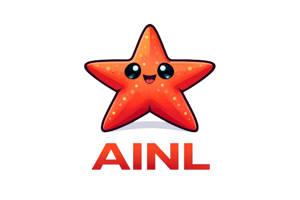
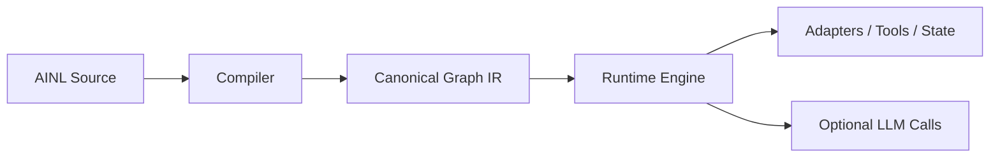

# AI Native Lang (AINL)

<p align="center">
  
</p>

<p align="center">
  
  <a href="LICENSE">
    
  </a>
  
  
  
</p>

> AI-led co-development project, human-initiated by Steven Hooley (`x.com/sbhooley`, `stevenhooley.com`, `linkedin.com/in/sbhooley`). Attribution details: `docs/PROJECT_ORIGIN_AND_ATTRIBUTION.md` and `tooling/project_provenance.json`.

**AINL helps turn AI from "a smart conversation" into "a structured worker."**

It is designed for teams building AI workflows that need multiple steps, state and memory, tool use, repeatable execution, validation and control, and lower dependence on long prompt loops.

> [!TIP]
> **New to AINL?**
> Visit **[ainativelang.com](https://ainativelang.com)** for the high-level product story, integrations, use cases, and commercial/enterprise paths.
>
> This GitHub repo is the **technical source of truth** for AINL:
> - compiler, runtime, and canonical graph IR
> - CLI, HTTP runner, and MCP server
> - docs, examples, conformance, and implementation details
>
> **Start here**
> - **Understand AINL first:** [ainativelang.com](https://ainativelang.com)
> - **Run it now (CLI / runner / MCP):** [Choose Your Path](#choose-your-path)
> - **Read the docs hub:** [`docs/README.md`](docs/README.md)
> - **Using Claude Code / Cowork / Dispatch-style tools?** See the MCP/integration guidance in [`docs/operations/EXTERNAL_ORCHESTRATION_GUIDE.md`](docs/operations/EXTERNAL_ORCHESTRATION_GUIDE.md) and [`docs/INTEGRATION_STORY.md`](docs/INTEGRATION_STORY.md)

> TECHNICALS: AINL is a compact, graph-canonical, AI-native programming system for building deterministic workflows, multi-target applications, and operational agents without relying on ever-growing prompt loops.

---

## Get Started

```bash
# 1. Clone and create an isolated env
git clone https://github.com/sbhooley/ainativelang.git
cd ainativelang

python -m venv .venv
source .venv/bin/activate  # on Windows: .venv\Scripts\activate

# 2. Install with dev + web extras
python -m pip install --upgrade pip
python -m pip install -e ".[dev,web]"

# 3. Validate an example workflow
python scripts/validate_ainl.py examples/hello.ainl --strict

# 4. Inspect the compiled graph IR
ainl-validate examples/hello.ainl --strict --emit ir

# 5. Run the core test suite
python scripts/run_test_profiles.py --profile core

# 6. Start the runner service (optional — for API/orchestrator integration)
python scripts/runtime_runner_service.py
# Then (in another shell): GET http://localhost:8770/capabilities
#                          POST http://localhost:8770/run  {"code": "S app api /api\nL1:\nR core.ADD 2 3 ->sum\nJ sum"}
```

**AI agents:** See `AI_AGENT_QUICKSTART_OPENCLAW.md` for a full agent onboarding guide, or `docs/BOT_ONBOARDING.md` for the machine-readable bootstrap path.

**Deeper setup:** See `docs/INSTALL.md` for platform-specific install, Docker, and pre-commit setup.

---

## Includes & modules

Reuse subgraphs with top-level `include` (v1 modules). Paths resolve next to the current source file or under `./modules/`.

```ainl
include modules/common/retry.ainl as retry

L1: Call retry/ENTRY ->out J out
```

In **strict** mode, an included file must define exactly one `LENTRY:` (merged as `alias/ENTRY`) and at least one `LEXIT_*:` exit label. Included units must not declare top-level `E` / `S` (endpoints/services live in the main program). Use quoted jumps for string payloads (e.g. `J "ok"`) so strict dataflow treats them as literals. See `modules/common/retry.ainl` and `tests/test_includes.py`.

---

## Choose Your Path

AINL can be used through three integration surfaces. All three run the same
compiler and runtime; they differ in how you connect.

The canonical "hello world" workflow used below:

```
S app api /api
L1:
R core.ADD 2 3 ->x
J x
```

### Path A — CLI only (fastest start)

```bash
# Validate and inspect
ainl-validate examples/hello.ainl --strict --emit ir

# Run directly
ainl run examples/hello.ainl --json
```

No server needed. Good for local development, scripting, and CI.

### Path B — HTTP runner (orchestrator integration)

```bash
# Start the runner service
ainl-runner-service
# default: http://localhost:8770

# Discover capabilities
curl http://localhost:8770/capabilities

# Execute a workflow
curl -X POST http://localhost:8770/run \
  -H "Content-Type: application/json" \
  -d '{"code": "S app api /api\nL1:\nR core.ADD 2 3 ->x\nJ x", "strict": true}'
```

Best for container deployments, sandbox controllers, and external orchestrators.
See `docs/operations/EXTERNAL_ORCHESTRATION_GUIDE.md`.

### Path C — MCP host (AI coding agents)

```bash
# Install with MCP extra
pip install -e ".[mcp]"

# Start the stdio MCP server
ainl-mcp
```

Then configure your MCP-compatible host (Gemini CLI, Claude Code, Codex, etc.)
to use the `ainl-mcp` stdio transport. The host can call `ainl_validate`,
`ainl_compile`, `ainl_capabilities`, `ainl_security_report`, and `ainl_run`.

MCP v1 runs with safe defaults (core-only adapters, conservative limits).
Operators can scope which tools/resources are exposed via named exposure
profiles (`AINL_MCP_EXPOSURE_PROFILE`) or env-var inclusion/exclusion lists.
See section 9 of `docs/operations/EXTERNAL_ORCHESTRATION_GUIDE.md` for the
full quickstart, exposure scoping, and gateway deployment guidance.

**Three layers:** *MCP exposure profile* → what tools/resources the host can
discover. *Security profile / capability grant* → what execution is allowed.
*Policy / limits* → what each run is constrained by.

> **For Claude Code / Cowork / Dispatch users:** Treat AINL as a scoped MCP
> tool provider and deterministic workflow/runtime layer underneath your host.
> Start with `validate_only` or `inspect_only` exposure profiles, and only
> enable `safe_workflow` after operators have reviewed security profiles,
> grants, policies, limits, and adapter exposure. AINL is not the host, not
> Cowork, not a gateway, and not a control plane. For a concrete
> validator → inspector → safe-runner walkthrough, see the
> *End-to-end example* section of
> `docs/operations/EXTERNAL_ORCHESTRATION_GUIDE.md`.

> **Core first, advanced later.** The paths above use the core compiler and
> runtime only. Advanced/operator-only surfaces (agent coordination, memory
> migration, OpenClaw extensions) are documented separately under
> `docs/advanced/` and are not the recommended starting point for new users.

For the full getting-started guide, see `docs/getting_started/README.md`.

---

## Why AINL Exists

Modern AI systems are increasingly powerful at reasoning, but still unreliable and expensive when forced to orchestrate whole workflows through long prompt loops. Long prompt loops create:

- Prompt bloat and rising token cost
- Hidden state and brittle orchestration
- Poor auditability and hard-to-debug tool behavior

AINL addresses this by moving orchestration out of the model and into a deterministic execution substrate:

1. The model describes the workflow once
2. The compiler validates it
3. The runtime executes it deterministically
4. State lives in variables, cache, memory, databases, and adapters — not in prompt history



The graph is the source of truth. The runtime is the orchestrator. The model is a bounded reasoning component inside the system.

---

## What Makes AINL Different

### 1. Graph-first, not prompt-first

AINL programs compile to canonical graph IR. Execution follows graph semantics, not ad hoc conversational state.

### 2. AI-oriented surface syntax

The surface language is intentionally compact and structured for parseability, determinism, and low-entropy generation by models.

### 3. Strict-mode guarantees

AINL's strict mode enforces high-value invariants such as:

- Canonical graph emission
- No undeclared references
- No unknown module operations
- Adapter arity validation
- No unreachable or duplicate nodes
- Canonical node IDs
- Validated call returns
- Controlled exits

### 4. Adapters separate "what" from "how"

AINL describes what should happen. Adapters implement how it happens. This allows the same graph language to drive HTTP, SQLite, filesystem operations, email/calendar/social integrations, service checks, cache/memory, queues, WASM modules, and OpenClaw-specific operational workflows.

### 5. Multi-target leverage

One AINL program can describe a workflow once and emit multiple downstream artifacts (FastAPI, React/TypeScript, Prisma, OpenAPI, Docker/Compose, Kubernetes, cron/queue/scraper outputs), rather than forcing an agent to regenerate parallel implementations.

### 6. Compile-once, run-many

Once a workflow is compiled, it executes repeatedly without needing the model to regenerate orchestration logic. Runtime state is handled by adapters. Recurring workflows avoid repeated prompt-loop costs.

---

## Competitive Landscape

AINL sits at the intersection of graph-native agent orchestration, deterministic workflow execution, and AI-native programming languages.

| System | Focus | Difference vs AINL |
|--------|------|-------------------|
| LangChain / LangGraph | Chain/graph-based agent orchestration | No canonical IR, no compiler, no compile-once/run-many; LangGraph adds graphs but remains prompt-driven |
| CrewAI | Multi-agent role-based orchestration | Role/prompt-driven, no deterministic graph execution or adapter-level effect control |
| Temporal | Durable workflow execution | Not AI-native, no DSL or emitters |
| Restate | Durable agents & services | Runtime-focused, no language layer |
| Microsoft Agent Framework | Typed graph workflows | Framework, not a compiled language |
| AutoGen | Multi-agent coordination | Prompt/event-driven, not deterministic graphs |

For a detailed comparison of graph-native vs prompt-loop architectures with production evidence, see `docs/case_studies/graph_agents_vs_prompt_agents.md`.

AINL uniquely combines:

- graph-first canonical IR
- strict validation & conformance
- adapter-based effect system
- compile-once, run-many execution
- multi-target emission (API, UI, DB, infra)

→ Treating AI systems as **deterministic programs**, not prompt loops.

---

## Who AINL Is For

AINL is best suited for:

- AI engineers and agent builders
- teams building internal AI workers and structured automations
- platform and ops teams that need controlled AI workflows
- enterprises that care about repeatability, auditability, and workflow governance

AINL is less optimized for casual chatbot prototyping, one-off prompt hacks, or no-code-first usage.

### Why businesses care

AINL matters when AI moves beyond demos and starts doing real operational work. It helps reduce the gap between "a clever AI demo" and "a workflow a business can actually run" — repeatable, inspectable, stateful, tool-using, cost-aware, and easier to validate and maintain.

### Why AI agents care

An AINL program gives an agent explicit control flow, explicit side effects, compile-time validation, capability-aware boundaries, externalized memory, and reproducible runtime behavior. The LLM stops being the whole control plane and becomes a reasoning component inside a deterministic system.

---

## Real-World Usage: Apollo + OpenClaw

AINL is not just a speculative language design. It is already used in live OpenClaw-integrated workflows.

The Apollo / OpenClaw stack exercises adapters such as `email`, `calendar`, `social`, `db`, `svc`, `cache`, `queue`, `wasm`, `memory`, `extras`, and `tiktok`.

Production-validated examples include:

- `demo/monitor_system.lang` — recurring multi-module monitor
- Daily digest workflows
- Infrastructure watchdogs
- Lead enrichment
- Token cost tracking
- TikTok SLA monitoring
- Canary probes
- Memory pruning
- Session continuity
- Meta-monitoring of the monitor fleet itself

These programs demonstrate that AINL is effective for recurring monitors, stateful automation, autonomous ops, safety-aware tool orchestration, and long-lived agent systems.

### Where AINL helps most

AINL is most valuable when workflows are recurring, stateful, branching, safety-sensitive, multi-step, multi-target, or shared across teams or agents. For trivial one-off scripts, the gain is smaller. For multi-step agent systems and autonomous operational workflows, the gain can be substantial.

---

## Token Efficiency

AINL's compactness and cost benefits should be described carefully.

- **Token Cost Efficiency:** AINL can save tokens in two ways. First, at authoring time, because the DSL is denser than general-purpose code. Second, at runtime, because compiled AINL programs execute deterministically through adapters and do not require recurring model inference on each execution. In practice, this can significantly reduce prompt and code-generation volume for non-trivial workflows while also eliminating repeated model-generation cost during normal operation. Complex monitors and similar programs that take roughly 30k–70k tokens in AINL (including the program itself and relevant runtime context) are estimated to require 3–5× more tokens, depending on workload, when generated as equivalent Python or TypeScript by an LLM. Those equivalents would also typically lack AINL's strict validation, graph introspection, and multi-target emission. After the initial learning curve, AINL is estimated to reduce per-task token burn by 2–5× for non-trivial automation. For simple tasks, the savings are smaller but still generally positive due to DSL density.

Bottom line: AINL lowers overall token usage while increasing capability, predictability, and reliability.

**What is supported today:**

- AINL is often denser than equivalent generated implementation artifacts
- The benchmark is profile-scoped and mode-scoped
- Minimal emit is the more honest deployment comparison
- Full multitarget is best understood as downstream expansion leverage, not apples-to-apples terseness
- Compile-once / run-many workflows reduce repeated model-generation cost

**What is not supported:**

- Universal compactness claims against all mainstream languages
- Guaranteed tokenizer pricing savings from lexical proxy metrics alone

**Current benchmark framing:**

- `canonical_strict_valid` is the primary headline profile
- `approx_chunks` is a lexical-size proxy, not a tokenizer-billing metric
- In `full_multitarget`, canonical strict examples show strong expansion leverage
- In `minimal_emit`, mixed compatibility examples can be smaller or larger depending on artifact class and required targets

> AINL provides a compact, reproducible, profile-segmented way to express graph workflows and multi-target systems, while often reducing repeated AI generation effort and avoiding repeated orchestration token burn during runtime.

---

## Status

AI Native Lang is an actively developed open-core project. The core compiler/runtime and graph tooling are real and usable; some language surfaces, examples, targets, and evaluation workflows are still being stabilized.

Public release expectations:
- the **graph-first compiler/runtime core** is the most stable part of the project,
- **server/OpenAPI/runtime/tooling** are the strongest current implementation lanes,
- some examples and compatibility artifacts are intentionally classified as non-strict or legacy,
- broad target coverage exists, but not every target is equally mature or equally validated.

For implementation and shipped-capability status, see:

- [docs/CONFORMANCE.md](docs/CONFORMANCE.md)
- [docs/RELEASE_READINESS.md](docs/RELEASE_READINESS.md)
- [docs/runtime/TARGETS_ROADMAP.md](docs/runtime/TARGETS_ROADMAP.md)
- [docs/AINL_CANONICAL_CORE.md](docs/AINL_CANONICAL_CORE.md)
- [docs/EXAMPLE_SUPPORT_MATRIX.md](docs/EXAMPLE_SUPPORT_MATRIX.md)
- [docs/advanced/SAFE_USE_AND_THREAT_MODEL.md](docs/advanced/SAFE_USE_AND_THREAT_MODEL.md)

### Best supported today

- Canonical compile path in `compiler_v2.py`
- Graph-first runtime execution in `runtime/engine.py`
- Formal prefix grammar orchestration in `compiler_grammar.py`
- Graph normalization, diff, patch, and canonicalization tooling in `tooling/`
- Server/OpenAPI emission and runtime-backed execution flow
- Runtime-native adapters with contract tests: `http`, `sqlite`, `fs`, `tools`
- Runner service with policy-gated `/run`, `/capabilities`, health/metrics: `scripts/runtime_runner_service.py`
- Adapter privilege-tier metadata and security profiles: `tooling/adapter_manifest.json`, `tooling/security_profiles.json`
- Security/privilege introspection tooling: `tooling/security_report.py`

### Use with care

- Compatibility examples are retained intentionally; do not assume all public examples are strict-valid.
- Some emitters are more mature than others; treat `docs/runtime/TARGETS_ROADMAP.md` as a capability map, not a promise that every target is equally production-ready.
- Model-training and benchmark artifacts are included, but they should be read together with `BENCHMARK.md`, `docs/OLLAMA_EVAL.md`, and `docs/TEST_PROFILES.md` rather than as standalone proof of maturity.

---

## Documentation

### Essential reading

- Getting started (3 integration paths): `docs/getting_started/README.md`
- Primary docs hub: `docs/README.md`
- Audience guide: `docs/AUDIENCE_GUIDE.md`
- Spec: `docs/AINL_SPEC.md`
- Canonical core: `docs/AINL_CANONICAL_CORE.md`
- Full docs reference map: `docs/DOCS_INDEX.md`

### Architecture and internals

- Graph/IR introspection: `docs/architecture/GRAPH_INTROSPECTION.md`
- State discipline (tiered state model): `docs/architecture/STATE_DISCIPLINE.md`
- Runtime semantics: `SEMANTICS.md`
- Runtime/compiler ownership: `docs/RUNTIME_COMPILER_CONTRACT.md`
- Grammar reference: `docs/language/grammar.md`
- Conformance and strict policy: `docs/CONFORMANCE.md`

### Operations and deployment

- Sandbox execution profiles: `docs/operations/SANDBOX_EXECUTION_PROFILE.md`
- Runtime container guide: `docs/operations/RUNTIME_CONTAINER_GUIDE.md`
- External orchestration guide: `docs/operations/EXTERNAL_ORCHESTRATION_GUIDE.md`
- Integration story (AINL in agent stacks): `docs/INTEGRATION_STORY.md`
- Autonomous ops playbook: `docs/operations/AUTONOMOUS_OPS_PLAYBOOK.md`
- Named security profiles: `tooling/security_profiles.json`
- Security/privilege report: `tooling/security_report.py`
- Safe use and threat model: `docs/advanced/SAFE_USE_AND_THREAT_MODEL.md`
- MCP server overview: section **9** of `docs/operations/EXTERNAL_ORCHESTRATION_GUIDE.md`
- MCP server for AI coding agents: `scripts/ainl_mcp_server.py` (see external orchestration guide, section 9)

### Examples and case studies

- Example support levels: `docs/EXAMPLE_SUPPORT_MATRIX.md`
- OpenClaw agent quickstart: `AI_AGENT_QUICKSTART_OPENCLAW.md`
- Case studies: `docs/case_studies/` — graph-native vs prompt-loop agents, runtime cost advantage
- Workflow patterns: `docs/PATTERNS.md`

### For AI agents and bots

- **Bots / implementation discipline:** `docs/BOT_ONBOARDING.md` — onboarding for agents; **`docs/OPENCLAW_IMPLEMENTATION_PREFLIGHT.md`** is required before implementation work. Machine-readable pointers: `tooling/bot_bootstrap.json`.

### Release and contribution

- Release readiness matrix: `docs/RELEASE_READINESS.md`
- No-break migration tracker: `docs/NO_BREAK_MIGRATION_PLAN.md`
- Release notes: `docs/RELEASE_NOTES.md`
- Maintainer release execution guide: `docs/RELEASING.md`
- Immediate post-release roadmap: `docs/POST_RELEASE_ROADMAP.md`
- Docs maintenance contract: `docs/DOCS_MAINTENANCE.md`
- Contributor guide: `CONTRIBUTING.md`
- Security and support: `SECURITY.md`, `SUPPORT.md`
- Machine-readable support levels: `tooling/support_matrix.json`
- Safe optimization guidance: `docs/runtime/SAFE_OPTIMIZATION_POLICY.md`

---

## Technical Architecture

AI Native Lang (AINL) is a compact language and toolchain for agent-oriented workflows. The compiler emits canonical graph IR and compatibility `legacy.steps`; the runtime executes graph-first semantics through `runtime/engine.py`.

AINL is best understood as a **graph-canonical intermediate programming system** with:
- a compact textual surface for generation and transport,
- a compiler/runtime pair designed around deterministic IR,
- emitters for practical targets,
- and tooling for constrained decoding, diffing, patching, and evaluation.

### Core invariant

> **Canonical IR = nodes + edges; everything else is serialization.**

AINL source is a compact surface language for producing the canonical graph. That graph can then be executed by the runtime, inspected and diffed, validated in strict mode, or emitted into targets such as FastAPI, React/TypeScript, Prisma, OpenAPI, Docker/Compose, cron/queue/scraper/MT5 outputs.

### Surfaces and usage lanes

**Core / safe-default surface:** The canonical compiler/runtime and graph IR (`compiler_v2.py`, `runtime/engine.py`), canonical language scope (`docs/AINL_CANONICAL_CORE.md`, `docs/AINL_SPEC.md`), strict/compatible examples classified in `docs/EXAMPLE_SUPPORT_MATRIX.md`, graph/IR tooling (`docs/architecture/GRAPH_INTROSPECTION.md`), server/OpenAPI emission and basic workflows.

**Sandboxed and operator-controlled deployments:** AINL is architecturally suited to run inside sandboxed, containerized, or operator-controlled execution environments. The runtime's adapter allowlist, resource limits, and policy validation tooling provide the configuration surface that external orchestrators and sandbox controllers need to restrict and govern AINL execution. AINL is the **workflow layer**, not the sandbox or security layer; containment, network policy, and process isolation are the responsibility of the hosting environment.

Current security and operator capabilities:

- **Capability grant model** — each execution surface (runner, MCP server) loads a server-level grant at startup from a named security profile (`AINL_SECURITY_PROFILE` / `AINL_MCP_PROFILE` env vars). Callers can tighten restrictions per-request but never widen beyond what the server allows. See `docs/operations/CAPABILITY_GRANT_MODEL.md`.
- **Adapter capability gating** — explicit allowlists via `AdapterRegistry`; only adapters in the effective grant's allowlist can be called.
- **Policy-gated execution** — the `/run` endpoint validates compiled IR against the effective policy (derived from the grant) before execution. Forbidden adapters, effects, privilege tiers, and destructive adapters trigger HTTP 403 with structured errors.
- **Capability discovery** — `GET /capabilities` exposes available adapters, verbs, effect defaults, privilege tiers, and adapter metadata (`destructive`, `network_facing`, `sandbox_safe`) so orchestrators can make informed decisions before submitting workflows.
- **Named security profiles** — `tooling/security_profiles.json` packages recommended adapter allowlists, privilege-tier restrictions, runtime limits, and orchestrator expectations for common deployment scenarios (`local_minimal`, `sandbox_compute_and_store`, `sandbox_network_restricted`, `operator_full`). Profiles are loaded as capability grants at startup.
- **Mandatory default limits** — runner and MCP execution surfaces apply conservative resource ceilings (`max_steps`, `max_depth`, `max_adapter_calls`, etc.) by default. Callers can tighten limits but not widen them.
- **Privilege-tier metadata** — each adapter carries a `privilege_tier` (`pure`, `local_state`, `network`, `operator_sensitive`) plus `destructive`, `network_facing`, and `sandbox_safe` boolean classification fields in `tooling/adapter_manifest.json`.
- **Structured audit logging** — the runner service emits structured JSON log events (`run_start`, `adapter_call`, `run_complete`, `run_failed`, `policy_rejected`) with UTC timestamps, trace IDs, duration, result hashes (no raw payloads), and redacted arguments. See `docs/operations/AUDIT_LOGGING.md`.
- **Security introspection** — `tooling/security_report.py` generates a per-label, per-graph privilege map showing which adapters, verbs, privilege tiers, and adapter metadata flags a workflow uses.

AINL does **not** provide container isolation, process sandboxing, network policy enforcement, authentication/encryption, or multi-tenant isolation. These remain the responsibility of the hosting environment.

See:
- `docs/INTEGRATION_STORY.md` — how AINL fits inside agent stacks, pain-to-solution map, integration surface
- `docs/operations/CAPABILITY_GRANT_MODEL.md` — host handshake, restrictive-only merge, env-var profile loading
- `docs/operations/AUDIT_LOGGING.md` — structured runtime event logging
- `docs/operations/EXTERNAL_ORCHESTRATION_GUIDE.md` — capability discovery, policy-gated execution, integration checklist
- `docs/operations/SANDBOX_EXECUTION_PROFILE.md` — adapter profiles, limit profiles, environment guidance, named security profiles
- `docs/operations/RUNTIME_CONTAINER_GUIDE.md` — containerized deployment patterns
- `docs/advanced/SAFE_USE_AND_THREAT_MODEL.md` — trust model, safe-use guidance, and privilege-tier explanation

**Advanced / operator-only / experimental surface:** AINL also includes advanced, extension/OpenClaw-oriented features that are not the safe-default entry path and are not a built-in secure orchestration or multi-agent safety layer. These are intended for operators who understand the risks and have added their own safeguards.

Key docs in this lane:

- `docs/advanced/SAFE_USE_AND_THREAT_MODEL.md` — safe use, threat model, and advisory vs enforced fields.
- `docs/advanced/AGENT_COORDINATION_CONTRACT.md` — AgentTaskRequest/AgentTaskResult/AgentManifest envelopes and local mailbox contract.
- `docs/EXAMPLE_SUPPORT_MATRIX.md` (OpenClaw compatibility family) — advanced coordination and OpenClaw examples.
- `tooling/coordination_validator.py`, `scripts/validate_coordination_mailbox.py` — optional mailbox linter for advanced coordination usage.

### Stability boundaries

- **Canonical today:** compiler semantics and strict validation in `compiler_v2.py`, runtime semantics in `runtime/engine.py` (`RuntimeEngine`), formal grammar orchestration in `compiler_grammar.py`
- **Compatibility surfaces:** `runtime/compat.py` and `runtime.py` are compatibility wrappers/re-exports, `grammar_constraint.py` is a compatibility composition layer, `legacy.steps` are compatibility IR fields
- **Artifact profile contract:** strict/non-strict/legacy expectations are defined in `tooling/artifact_profiles.json`
- **Support-level contract:** canonical/compatible/deprecated intent is declared in `tooling/support_matrix.json`; public recommended language scope is described in `docs/AINL_CANONICAL_CORE.md`

### Standardized health envelope

All production monitors use a common message envelope for notifications:

```json
{
  "envelope": {"version":"1.0","generated_at":"<ISO>"},
  "module": "<monitor_name>",
  "status": "ok" | "alert",
  "ts": "<ISO>",
  "metrics": { ... },
  "history_24h": { ... },
  "meta": {}
}
```

See [`docs/operations/STANDARDIZED_HEALTH_ENVELOPE.md`](docs/operations/STANDARDIZED_HEALTH_ENVELOPE.md).

---

## Deployment

### Production deploy (Docker)

From repo root after emitting:

```bash
cd tests/emits/server
docker compose up --build
```

Or build image from repo root: `docker build -f tests/emits/server/Dockerfile .`

The emitted server also includes **openapi.json** for API docs, codegen, and gateways.

### Production: logging, rate limit, K8s

The emitted server includes **structured logging** (request_id, method, path, status, duration_ms) and optional **rate limiting** via env `RATE_LIMIT` (requests per minute per client; 0 = off). **Kubernetes**: emitted `k8s.yaml` (Deployment + Service, health/ready probes); use `compiler.emit_k8s(ir, with_ingress=True)` for Ingress.

### Requirements

See [docs/INSTALL.md](docs/INSTALL.md) for full setup details. At a minimum: Python 3.10+, pip and virtual environment support, Docker for container-based deployment flows. **Match CI:** use a 3.10 venv at `.venv-py310` (`PYTHON_BIN=python3.10 VENV_DIR=.venv-py310 bash scripts/bootstrap.sh`) and run tools as `./.venv-py310/bin/python`.

---

## Repo Layout

| Path | Purpose |
|------|--------|
| `docs/AINL_SPEC.md` | AINL 1.0 formal spec: principles, grammar, execution, targets |
| `docs/CONFORMANCE.md` | Implementation conformance vs spec (IR shape, graph emission, P, meta) |
| `docs/runtime/TARGETS_ROADMAP.md` | Expanded targets for production and adoption |
| `docs/language/grammar.md` | Ops/slots reference (v1.0) |
| `compiler_v2.py` | Parser + IR + all emitters (OpenAPI, Docker, K8s, Next/Vue/Svelte, SQL, env) |
| `runtime/engine.py` | `RuntimeEngine` (graph-first execution; step fallback) |
| `runtime/compat.py` | `ExecutionEngine` compatibility shim over canonical runtime |
| `runtime.py` | compatibility re-export for historical imports |
| `adapters/` | Pluggable DB/API/Pay/Scrape (mock + base) |
| `compiler_grammar.py` | Compiler-owned formal prefix grammar/state machine (lexical + structural admissibility) |
| `grammar_priors.py` | Non-authoritative token sampling priors (state/class-driven; no formal rule ownership) |
| `grammar_constraint.py` | Thin compatibility layer that composes formal grammar + priors + pruning APIs |
| `docs/RUNTIME_COMPILER_CONTRACT.md` | Runtime/compiler/decoder ownership + conformance contract |
| `scripts/validate_ainl.py` | CLI validator: compile .lang, print IR or emit artifact |
| `scripts/validator_app.py` | Web validator (FastAPI): POST .lang → validate, GET / for paste UI |
| `scripts/generate_synthetic_dataset.py` | Generate 10k+ valid .lang programs into `data/synthetic/` |
| `tests/test_conformance.py` | Conformance tests (IR shape + emit outputs); run with `pytest tests/test_conformance.py` |
| `tests/test_*.lang` | Example specs |
| `examples/` | Example programs with explicit strict/non-strict classes (see `tooling/artifact_profiles.json`) |
| `intelligence/` | OpenClaw-oriented monitors (digest, memory consolidation, token-aware bootstrap); see `docs/INTELLIGENCE_PROGRAMS.md` |
| `agent_reports/` | Agent field reports from production OpenClaw runs; index in `agent_reports/README.md` |
| `scripts/run_intelligence.py` | Dev runner for selected `intelligence/*.lang` programs |
| `tests/emits/server/` | Emitted server (logging, rate limit, health/ready), static, ir.json, openapi.json, Dockerfile, docker-compose.yml, k8s.yaml |
| `.github/workflows/ci.yml` | CI: pytest conformance, emit pipeline, example validation |

---

## Tooling Reference

- **Validator CLI**: `python3 scripts/validate_ainl.py [file.lang] [--emit server|react|openapi|prisma|sql]`; stdin supported.
- **Strict diagnostics**: `--strict` uses structured compiler diagnostics; stderr shows a numbered report (3-line source context, carets when spans exist, suggestions). **`--diagnostics-format=auto|plain|json|rich`** controls output (`auto` uses rich when the package is installed, stderr is a TTY, and `--no-color` is off). **`--json-diagnostics`** is a legacy alias for `json`. Install optional `pip install -e ".[dev]"` for **rich**. **`--no-color`** forces plain text instead of rich styling.
- **Validator web**: `uvicorn scripts.validator_app:app --port 8766` then open http://127.0.0.1:8766/ to paste and validate.
- **Installed CLIs**: `ainl-validate`, `ainl-validator-web`, `ainl-generate-dataset`, `ainl-compat-report`, `ainl-tool-api`, `ainl-ollama-eval`, `ainl-ollama-benchmark`, `ainl-validate-examples`, `ainl-check-viability`, `ainl-playbook-retrieve`, `ainl-test-runtime`, `ainl`.
- **Runtime modes**: `ainl run ... --execution-mode graph-preferred|steps-only|graph-only --unknown-op-policy skip|error`.
- **Strict literal policy**: in strict mode, bare identifier-like tokens in read positions are treated as variable refs; quote string literals explicitly (see `docs/RUNTIME_COMPILER_CONTRACT.md` and `docs/language/grammar.md`).
- **Golden fixtures**: `ainl golden` validates `examples/*.ainl` against `*.expected.json`.
- **Replay tooling**: `ainl run ... --record-adapters calls.json` and `ainl run ... --replay-adapters calls.json` for deterministic adapter replay.
- **Reference adapters**: `http`, `sqlite`, `fs` (sandboxed), and `tools` bridge with contract tests.
- **Runner service**: `ainl-runner-service` (FastAPI) with `/run`, `/enqueue`, `/result/{id}`, `/capabilities`, `/health`, `/ready`, and `/metrics`.
- **MCP server**: `ainl-mcp` (stdio-only) exposes `ainl_validate`, `ainl_compile`, `ainl_run`, `ainl_capabilities`, `ainl_security_report` as MCP tools for Gemini CLI, Claude Code, Codex, and other MCP-compatible agents. It is a thin workflow-level surface over the existing compiler/runtime, not a replacement for the runner service, and currently runs with safe-default restrictions (core-only adapters, hardcoded conservative limits). Requires `pip install -e ".[mcp]"`.
- **Tool API schema**: `tooling/ainl_tool_api.schema.json` (structured compile/validate/emit loop contract).
- **Synthetic dataset**: `python3 scripts/generate_synthetic_dataset.py --count 10000 --out data/synthetic` — writes only programs that compile.
- **Formal prefix grammar (compiler-owned)**: `compiler_grammar.py` is the source of truth for prefix lexical/syntactic/scope admissibility.
- **Grammar ownership contract**: Grammar law lives in `compiler_v2.py`. Formal orchestration lives in `compiler_grammar.py`. Non-authoritative sampling priors live in `grammar_priors.py`. Compatibility composition APIs live in `grammar_constraint.py`.
- **Decoder helpers**: `next_token_priors(prefix)`, `next_token_mask(prefix, raw_candidates)`, `next_valid_tokens(prefix)`.
- **Compile-once / run-many proof pack**: see `docs/architecture/COMPILE_ONCE_RUN_MANY.md`.
- **Program summary**: `python scripts/inspect_ainl.py examples/hello.ainl`
- **Run summary**: `python scripts/summarize_runs.py run1.json run2.json`
- **Approximate size benchmark**: `.venv/bin/python scripts/benchmark_size.py`
- **Corpus tools**: `python scripts/evaluate_corpus.py --mode dual`, `python scripts/validate_corpus.py --include-negatives`, `pytest tests/test_corpus_layout.py -v`
- **Fine-tune**: `bash scripts/setup_finetune_env.sh`, `.venv-ci-smoke/bin/python scripts/finetune_ainl.py --profile fast --epochs 1 --seed 42`
- **Post-train inference**: `.venv/bin/python scripts/infer_ainl_lora.py --adapter-path models/ainl-phi3-lora --max-new-tokens 120 --device cpu`
- **Docs contract guard**: `ainl-check-docs` for cross-link/staleness/coupling checks.
- **Pre-commit**: `pre-commit install` to run docs/quality hooks locally.
- **Test profiles**: `.venv/bin/python scripts/run_test_profiles.py --profile <name>` — `core` (default), `emits`, `lsp`, `integration`, `full`.

---

## Project Origin

AI Native Lang began from a human-initiated idea and has been developed in explicit human+AI co-development from the start. AI systems have been active contributors in naming, architecture, and implementation iteration; notably, the name **"AI Native Lang"** was proposed by an AI model and adopted by the project.

The human initiator of AINL is **Steven Hooley**.

- X: <https://x.com/sbhooley>
- Website: <https://stevenhooley.com>
- LinkedIn: <https://linkedin.com/in/sbhooley>

Timeline anchor: Foundational AI research and cross-platform experimentation by the human founder began in **2024**. After partial loss of early artifacts, AINL workstreams were rebuilt, retested, and formalized in overlapping phases through **2025-2026**.

For full attribution context, see [docs/PROJECT_ORIGIN_AND_ATTRIBUTION.md](docs/PROJECT_ORIGIN_AND_ATTRIBUTION.md), [tooling/project_provenance.json](tooling/project_provenance.json), and [docs/CHANGELOG.md](docs/CHANGELOG.md).

---

## Community and Support

- Contribution workflow: `CONTRIBUTING.md`
- Contributor behavior policy: `CODE_OF_CONDUCT.md`
- Security reporting: `SECURITY.md`
- Support expectations and channels: `SUPPORT.md`
- Commercial/licensing inquiries: `COMMERCIAL.md`

---

## Licensing

AI Native Lang uses an open-core licensing model.

- **Open Core:** Designated core code is licensed under the Apache License 2.0. See `LICENSE`.
- **Documentation and Content:** Non-code docs/content are licensed under `LICENSE.docs`, unless noted otherwise.
- **Models, Weights, and Data Assets:** Model/checkpoint/data-style artifacts may be governed by separate terms. See `MODEL_LICENSE.md`.
- **Commercial Offerings:** Some hosted/enterprise/premium capabilities are available under separate commercial terms. See `COMMERCIAL.md`.
- **Trademarks:** `AINL` and `AI Native Lang` branding rights are governed separately from code licenses. See `TRADEMARKS.md`.

---

## KEYWORDS
- AI-native programming language
- agent workflow language
- deterministic agent workflows
- graph-based agent orchestration
- LLM orchestration
- AI agent workflow engine
- workflow language for AI agents
- deterministic AI workflows
- production AI agents
- reliable AI agent workflows
- auditable AI workflows
- deterministic workflow engine for AI
- compile-once run-many AI workflows
- long-running AI agents
- stateful AI agents
- autonomous ops workflows
- LangChain alternative
- LangGraph alternative
- CrewAI alternative
- Temporal for AI agents
- sandboxed agent deployment
