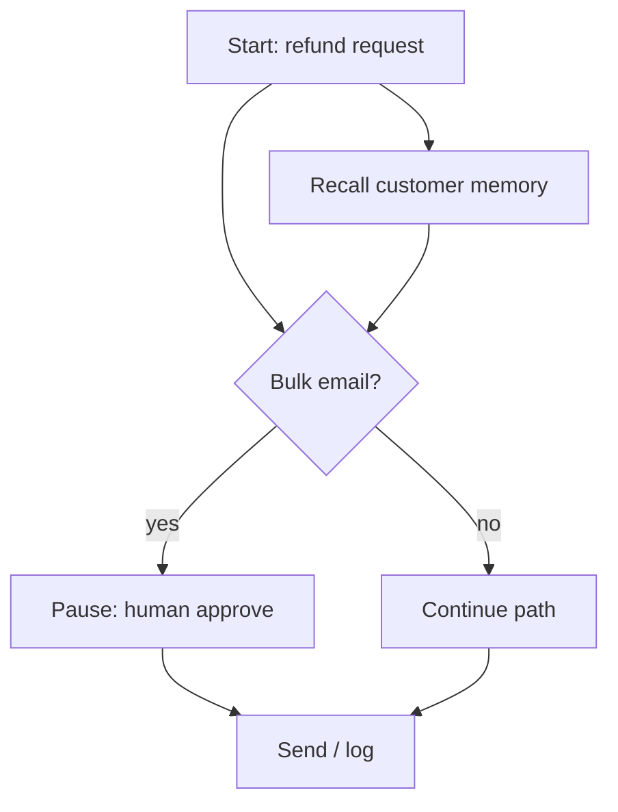

# Visual: prompt vs map

Some people learn faster with a picture. Here are two views of the same idea: **one big instruction blob** vs **what AINL is aiming at — a structured workflow graph** (steps + branches + tool hooks) that can be **validated** and executed by a **runtime**.

---

## ASCII — fastest anywhere

**Prompt-only (one scroll)**

```
┌─────────────────────────────────────────────────────────────┐
│  PLEASE DO REFUNDS CAREFULLY... REMEMBER RIVERA...          │
│  DON'T EMAIL EVERYONE... CHECK CUSTOMS... IF ... MAYBE ...   │
│  (page 2) ... ALSO STYLE ... ALSO NEVER ...                 │
└─────────────────────────────────────────────────────────────┘
          │
          ▼
    ??? each run re-reads & interprets ???
```

**AINL-style map (conceptual)**

```
  [ Start ] ──► [ Check order ] ──► [ Branch: damaged? ]
                      │                    │
                      │ yes                │ no
                      ▼                    ▼
              [ Photos + carrier ]    [ Standard path ]
                      │                    │
                      └─────────┬──────────┘
                                ▼
                      [ Approve if bulk mail? ]
                                │
                         human ◄─┘
```

The map version leaves room for **tools**, **branches**, and **stops** without stuffing them into paragraph six.

---

## Mermaid — if your viewer supports it

> GitHub, many Markdown preview tools, and some slide decks render Mermaid. If you see raw code, use the ASCII above or paste into [mermaid.live](https://mermaid.live).



Plain-language reading: **memory** can feed early; **branch** chooses path; **approve** is explicit.

---

## One slide sentence

**Prompts argue in paragraphs. Maps show the doors.**
