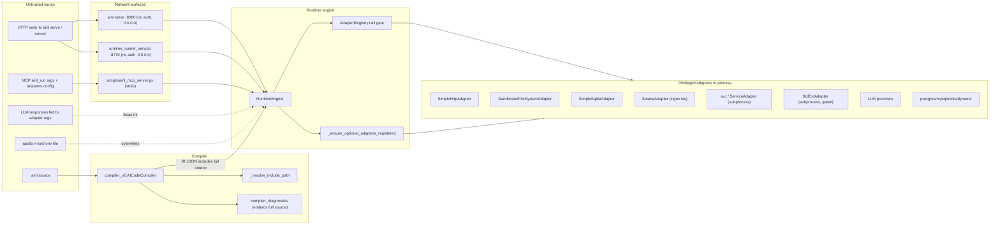

# AINL Security Review

> Independent security review of the AINL (AI Native Language) compiler + runtime + adapters platform, version 1.7.1.
> Date: 2026-04-22.
> Scope: Full audit covering malicious-code review, architecture/trust boundaries, `ainl serve` HTTP API, runtime runner service, MCP server, all major adapters, secrets/dependency supply chain, and compiler/IR/emitter injection surface.

## Top-line verdict per deployment mode

- **Local dev (`ainl run` on trusted `.ainl` files on engineer laptops):** Acceptable. Residual risks: `include` directive path traversal (P1) and silent auto-registration of network adapters (`web`, `tiktok`, `queue`, `a2a`) when IR mentions them.
- **Shared internal `ainl serve` / runtime runner service:** **Do not deploy as-is.** Both bind `0.0.0.0` with no auth, no body cap, no rate limit, and `ainl serve` has a literal `NameError` bug in `do_POST` that means the request body isn't even read.
- **AI agent executor (untrusted `.ainl` author):** **Not safe by default.** Capability gate is sound abstractly (`merge_grants` correctly intersects allowlists and takes min limits), but the engine silently re-registers `web`, `tiktok`, `queue`, `cache`, `memory`, `a2a` whenever the IR mentions them, bypassing the documented "core only by default" model. Solana `TRANSFER`/`INVOKE` have no destination/amount allowlist.
- **Production / customer-facing:** **Not ready.** Add auth, TLS, deny-by-default adapters, SSRF guards, and statement allowlists.

---

## Part 1 — Malicious-code review (the "is it safe to compile and execute?" check)

**Verdict: No intentional malicious code found. Confidence: medium-to-high.**

Two independent scans were run for the classic malware indicators. Every category came back clean.

| Check | Result |
|---|---|
| Decode-and-exec payloads (`base64.b64decode` → `exec`/`eval`/`compile`/`marshal.loads`/`pickle.loads`) | **Clean.** Every `b64decode` site decodes IR JSON or Solana transaction bytes. No `pickle.loads`, no `marshal`, no `dill`. |
| `eval(` / `exec(` / `compile()` of dynamic strings | **Clean.** Not present in compiler, runtime, adapters, or CLI. Only `re.compile` and the compiler's own `compile` method. |
| `yaml.load` (unsafe) | **Clean.** All YAML uses `yaml.safe_load`. |
| `subprocess` with `shell=True` or `os.system` / `os.popen` | **Clean.** Every shell-out uses argv lists; no string interpolation into a shell. |
| `__builtins__` mutation, monkey-patching `print`/`open`/`socket`/`os.system` | **Clean.** Not present. |
| Dynamic imports driven by URLs or attacker input | **Clean.** Every `importlib.util.spec_from_file_location` resolves to a file inside the repo (bridge entrypoints, test fixtures). No URL-driven imports. |
| Suspicious outbound endpoints (pastebin, ngrok, requestbin, transfer.sh, discord webhooks, dynamic-DNS, raw IPs, `.onion`) | **Clean.** Every hardcoded URL is a documented adapter target (`openrouter.ai`, `api.anthropic.com`, `api.cohere.ai`, `api.devnet.solana.com`, `hermes.pyth.network`, `api.openai.com`, `api.telegram.org`, `api.twitter.com`), an ecosystem source (`raw.githubusercontent.com` for the markdown importer), or documentation. |
| Third-party telemetry SDK initialization (PostHog, Sentry, Datadog, Mixpanel, Amplitude, Segment, Rollbar, NewRelic, Honeycomb) | **Clean.** None initialized in any `*.py`. The MCP server keeps in-process counters only and SHA-256s source for local validate→compile→run correlation — not shipped externally. (PostHog is documented as an *ArmaraOS desktop* concern; no key is baked into this repo.) |
| Import-time side effects in `__init__.py` (network, disk, subprocess) | **Clean.** Every `__init__.py` does pure re-exports / version metadata only. |
| Anti-analysis (VM/sandbox/debugger detection, hostname/user gating, time-bombs) | **Clean.** Not present. |
| Auto-update fetch-and-exec (`urlopen().read()` → `exec` / write `.py` and import) | **Clean.** Only an explicit user-triggered `pip install --upgrade ainativelang[mcp]` from PyPI in `cli/main.py` ~987. |
| Key/credential theft (scanning `~/.ssh/`, `~/.aws/`, `~/.gnupg/`, browser keychains, `wallet*`/`id_rsa*`) | **Clean.** Not present. |
| Home-rolled crypto / hardcoded keys / weak RNG for security purposes | **Clean.** `secrets.token_hex` for nonces; `random` only in synthetic-data generators. |
| Suspicious binary blobs (`.pkl`, `.pickle`, `.joblib`, hex-encoded payloads) | **Clean.** No pickled files committed. Large binaries are documented Phi-3 LoRA model checkpoints under `models/` with READMEs. |
| CI workflow abuse (`pull_request_target` with PR checkout, fork secret exfil, `curl \| sh` in steps) | **Clean.** No `pull_request_target`, no fork-secret patterns. Tag-pinned (vs SHA-pinned) actions are hygiene only. |
| Pre-commit hooks fetching/executing remote code | **Clean.** Only upstream `pre-commit-hooks` + a local `scripts/precommit_docs_contract.sh`. |

**Caveats — governance, not malware:**

- Git history shows mixed authorship including bot-style emails and machine-local `.local` hostnames (`clawdbot@Stevens-MacBook-Pro-2.local`, `ainl-king@openclaw.local`, `agent@plushify.ai`, `hermes_ainl@users.noreply.github.com`). If your engineering policy requires verified-signed commits, enforce it before importing.
- `tooling/markdown_importer.py` fetches markdown from upstream GitHub repos when you run `ainl import …` — that transitively trusts those upstream sources at import time.
- The local Apollo dashboard loads Chart.js from `cdn.jsdelivr.net`.

**Conclusion: it is safe to compile and execute this codebase from a malicious-code perspective.** The remaining risks documented in Parts 3+ are design weaknesses in trust-boundary handling, not hidden payloads.

### Pre-execution triage checklist (specific items every engineer should know)

A second deeper malicious-code scan run after the table above surfaced **seven concrete items** the table doesn't call out by name. None of them change the bottom-line verdict, but each is a real "trust the upstream" trigger that an engineer should acknowledge before running anything. This is what **P0** in the hardening checklist refers to.

| # | Item | What to do |
|---|---|---|
| PT-1 | **PyTorch pickle archives under `models/`.** Each LoRA checkpoint dir (`models/ainl-phi3-lora`, `…-v2`, `…-v3-curriculum`, `…-v4-regression`, `…-v6-breakthrough`, `…-v7-coverage`) ships `optimizer.pt`, `scheduler.pt`, and `training_args.bin` — `file(1)` confirms these are Zip-format PyTorch pickle archives (~34–36 MB each). Pickle deserialization can execute arbitrary Python. | The inference path uses the `adapter_model.safetensors` siblings (truly safe) and `tokenizer.json` (JSON). **Never** call `torch.load(<...>.pt, weights_only=False)` on the `.pt` / `.bin` files unless you trust the upstream that produced them; on PyTorch 2.4+ default `weights_only=True` is safe. They're training-only artifacts and aren't required at inference. |
| PT-2 | **`scripts/patch_bootstrap_loader.sh` mutates an external OpenClaw install.** It locates the OpenClaw npm CLI under `/opt/homebrew/.../openclaw` (or whatever `which openclaw` returns) and uses `sed -i` to splice JS into `workspace-*.js`. It's idempotent and backs up first, but it modifies a third-party install on your machine. | Do not run it unless you actively want to patch your OpenClaw. Not invoked by `ainl run` / `ainl serve` / MCP — only fires if a human runs the script. |
| PT-3 | **Verify `agent@plushify.ai` ("The Plushifier") is an expected collaborator.** Seven author identities total: `Steven Hooley <sbhooley@users.noreply.github.com>`, `Steven Hooley <steven@hooley.me>`, `sbhooley <6730846+sbhooley@users.noreply.github.com>`, `clawdbot <clawdbot@Stevens-MacBook-Pro-2.local>`, `AINL King <ainl-king@openclaw.local>`, `hermes_ainl <hermes_ainl@users.noreply.github.com>`, `The Plushifier <agent@plushify.ai>`. The first six cluster cleanly around one human + bot accounts on the same machine/GitHub org; `agent@plushify.ai` is the only fully external identity. | Confirm with the repo owner this was an intentional collaborator before importing. **Zero commits are GPG/SSH-signed** (`git log --pretty=format:'%G?'` returns `N` for all 423). If your team requires signed commits, enforce that policy before pulling new commits. |
| PT-4 | **History is young (422 of 423 commits in the last 90 days)**, single GitHub remote `https://github.com/sbhooley/ainativelang.git`, no `.gitmodules`, `git fsck --full` clean, no installed git hooks (only `*.sample`). Vendored sub-projects `armaraos/`, `apollo-x-bot/`, `openclaw/`, `zeroclaw/` are **in-tree copies**, not submodules. | Pickaxe scans confirm: `pickle.loads` = 0 commits, `os.system` = 0, `b64decode` = 1 (legitimate MIME use in `adapters/email.py`), `exec(` = 4 (all in normal compiler/release work, none from an unrecognized author). No additional action required beyond noting that a young, single-remote, unsigned-commit history rests entirely on GitHub account-level guarantees. |
| PT-5 | **`intelligence/**` paths auto-elevate (`AINL_ALLOW_IR_DECLARED_ADAPTERS=1`).** Already covered as finding H2 below, but worth surfacing as a *pre-execution* item: 18 directories of `.ainl` programs under `intelligence/` get a wider host-adapter grant by default. The env-mutation persists in long-lived workers. | If you haven't audited those graphs, set `AINL_INTELLIGENCE_FORCE_HOST_POLICY=1` in your environment before running anything from there. |
| PT-6 | **`apollo-x-bot/gateway_server.py` is 181 KB** — the largest single Python file outside the compiler. It's the Twitter/X promoter sidecar. Not used by `ainl run` / `ainl serve` / MCP. | If you intend to launch the apollo bot, that one file deserves a dedicated read pass before it's exposed to the network. |
| PT-7 | **`ainl_graph_memory_demo.py` and `ainl_graphy_memory.py`** at the repo root are byte-identical (20154 bytes). Typo-rename leftover. | Cosmetic, not security — flag for cleanup. |

WebAssembly artifacts are clean: `demo/wasm/health.wasm` (66 B) and `demo/wasm/metrics.wasm` (83 B) have matching `.wat` sources and are pure-arithmetic with no imports / no host calls / no I/O. No `.so` / `.dylib` / `.dll` / `.exe` shipped anywhere in tree. No committed `.env` / `.key` / `.pem` / `id_rsa*` / `credentials*` files (only `*.env.example` templates).

---

## Part 2 — Architecture & trust boundaries

The single capability chokepoint is `AdapterRegistry.call` in `runtime/adapters/base.py:83-91` — but `_ensure_optional_adapters_registered` (`runtime/engine.py:336-376`) circumvents it for several adapters.

---

## Part 3 — Findings by severity

### Critical (block any networked deployment)

- **C1. `ainl serve` is unauthenticated, binds 0.0.0.0, and `do_POST` has a `NameError`** — uses `body` before it's assigned. `cli/main.py:1207-1319, 1238-1242, 2556-2560`. `/run` would execute arbitrary AINL graphs against host adapters with no `limits` and no security profile applied. Wildcard CORS, no TLS, no rate limit, no body-size cap, generic `except Exception: str(e)` returned to client.
- **C2. `runtime_runner_service.py` is unauthenticated and binds 0.0.0.0:8770.** `scripts/runtime_runner_service.py:732-735`. Internally better (it does `merge_grants` + `validate_ir_against_policy` + applies limits) but still zero transport-layer auth.
- **C3. Compiler `include` directive has no project-root jail.** `compiler_v2.py:1306-1337` (`_resolve_include_path`). A hostile `.ainl` file can `include "../../../../etc/passwd"`; if the file is readable, contents are pulled into compilation. Critical wherever the compiler runs against untrusted source (MCP, serve, runner, CI).

### High

- **H1. `RuntimeEngine._ensure_optional_adapters_registered` undermines the "core only by default" story.** `runtime/engine.py:336-376`. Whenever the IR references `web`, `tiktok`, `queue`, `cache`, `memory`, `ainl_graph_memory`, or `a2a`, the engine silently registers them after the caller's registry was built. `cache` defaults to `~/.openclaw/ainl_cache.json` (escapes `fs.root`). `a2a` is built from `a2a_from_env()` (env-controlled hosts). Contradicts AGENTS.md and bypasses the MCP server's careful `adapters.enable` gating.
- **H2. Intelligence-path env mutation is sticky.** `cli/main.py:563-566` and `runtime/engine.py:401-415` set `os.environ["AINL_ALLOW_IR_DECLARED_ADAPTERS"]="1"` for any source path containing `intelligence`. Persists in the process across subsequent runs — sticky in long-lived MCP/serve workers. Operators must set `AINL_INTELLIGENCE_FORCE_HOST_POLICY=1` to opt out.
- **H3. SimpleHttpAdapter has no SSRF protection.** `runtime/adapters/http.py:36-43, 91-104`. Only checks `http`/`https` scheme and exact-hostname `allow_hosts`. With empty `allow_hosts`, **any** host is allowed (no block of 169.254.169.254, loopback, RFC1918). Redirects are followed without re-validating final hostname. CRLF in user-supplied header values not stripped.
- **H4. Solana `TRANSFER` and `INVOKE` have no destination/program/amount allowlist.** `adapters/solana.py:1232-1272, 1337-1371`. With a configured signing key (env or frame), an `.ainl` file can transfer lamports or invoke arbitrary programs to attacker-chosen addresses. Irreversible.
- **H5. MCP tools beyond `ainl_run` perform arbitrary file read/write and outbound HTTP.** `ainl_ir_diff`, `ainl_fitness_report`, `ainl_trace_export`, `ainl_import_clawflow`, `ainl_import_agency_agent`, `ainl_import_markdown` all accept caller-controlled paths and URLs and operate outside `fs.root`. `scripts/ainl_mcp_server.py` and `intelligence/trace_export_ptc_jsonl.py:82-104`.
- **H6. SQLite adapter has no statement classifier when `allow_write=True`.** `runtime/adapters/sqlite.py:32-46`. `ATTACH DATABASE`, dangerous `PRAGMA`, etc. pass the table-allowlist regex.
- **H7. Postgres/MySQL `query` path allows `SELECT INTO`** (DDL via SELECT) when DB user grants permit. `adapters/postgres/sql_guard.py:23-28`.
- **H8. Code-from-data injection in emitters.** `compiler_v2.py` `emit_python_scraper` (5642-5648) and `emit_python_api` (5609-5616) interpolate IR strings (URLs, route paths) into generated Python with f-strings and no escaping. A `'` in an IR-supplied URL/path breaks out of the string literal in the generated `.py`.
- **H9. `svc` and `std_ext` adapters shell out at host level.** `adapters/openclaw_integration.py:124-186` (`brew services restart`, `pkill -f`, `node …/server.js`). `adapters/std_ext.py:28-50` (gated by `AINL_EXT_ALLOW_EXEC=1`). High blast radius even though argv is structured (no `shell=True`).
- **H10. Full `.ainl` source embedded in IR JSON.** `compiler_v2.py:5233-5236`. Leaked through `POST /compile` (`cli/main.py:1278-1280`), MCP `ainl_compile` responses, `ainl visualize`/Mermaid R-line labels, and `scripts/emit_langgraph.py:24-50` (base64 embedded in generated Python). Big confidentiality blast for anything containing inline secrets.

### Medium

- **M1.** Redis adapter `allow_write` defaults True (`adapters/redis/adapter.py:53-54`).
- **M2.** `TiktokAdapter` hard-codes `/Users/clawdbot/...` SQLite path (`adapters/openclaw_integration.py:224-230`).
- **M3.** `apollo-x-bot/gateway_server.py:4315-4342` `_load_local_dotenv` overwrites `os.environ` from `.env`.
- **M4.** `armaraos/bridge/runner.py:245-248` sets a placeholder `OPENROUTER_API_KEY` when missing, masking misconfiguration.
- **M5.** `AINL_MCP_LLM_ENABLED` documented in AGENTS.md but not implemented (`scripts/ainl_mcp_server.py:1242-1253` only checks `AINL_CONFIG`).
- **M6.** AGENTS.md says `${SLACK_WEBHOOK}` interpolation works; it does not. Engine resolves `$var` against frame, env only via explicit `core.ENV`.
- **M7.** `fs` adapter — files with no extension bypass `allow_extensions` (`runtime/adapters/fs.py:30-31`); writes are enabled, only delete is gated by `allow_delete`.
- **M8.** Airtable attachment downloads default to allow-any host when `allow_attachment_hosts` is empty (`adapters/airtable/adapter.py:99-104`).
- **M9.** Generic `except Exception: str(e)` returned over HTTP/MCP — info disclosure (`cli/main.py:1260-1263`; runtime engine error messages embed source line: `runtime/engine.py:1851-1858`).
- **M10.** WASM adapter runs wasmtime on configured `.wasm` files (`runtime/adapters/wasm.py:37-72`). Native-equivalent in WASM sandbox; trust the source.

### Low / supply chain / hygiene

- **L1.** Many runtime deps unpinned (`>=` without upper bound in `pyproject.toml`); `requirements.txt` mixes pins and unbounded. Generate a lockfile.
- **L2.** GitHub Actions pinned to tags, not commit SHAs (`pypa/gh-action-pypi-publish@release/v1`, `actions/checkout@v6`).
- **L3.** `emit_docker_compose` template has default DB password `postgres` (`compiler_v2.py:6326-6365`).
- **L4.** Mermaid CDN with `securityLevel: "loose"` in visualize HTML helper.
- **L5.** CORS `Access-Control-Allow-Origin: *` on `ainl serve` JSON responses.
- **L6.** Synthetic-data scripts use `random` not `secrets` — fine today, do not reuse for session IDs.

### Positives (what's actually good)

- No `eval`/`exec`/`pickle.loads`/`marshal`/unsafe-`yaml.load` in compiler, runtime, or adapter core paths.
- `merge_grants` in `tooling/capability_grant.py:62-132` is correctly restrictive (intersection of allowlists, union of forbiddens, **min** of limits). MCP workspace `ainl_mcp_limits.json` cannot exceed the server ceiling.
- Postgres/MySQL/SQLite use parameterized queries.
- `runtime_runner_service.py` and `audit_trail.py` redact sensitive tokens in logged adapter calls/results.
- HTTP adapter enforces TLS verification (certifi when available), response size cap, and timeout.
- FS adapter jail uses `resolve()` + `parents` check — symlink escape blocked.
- Solana keypair loading is via env or file path, not committed; signing happens locally with `solders`.
- No `pull_request_target` / `workflow_run` abuse patterns in CI; `GH_PAT` not exposed to fork PRs.

---

## Part 4 — Per-deployment hardening matrix

- **Local dev only:** apply P1 (jail include), P2 (lock down `_ensure_optional_adapters_registered` or document it), P5 (MCP file-read tools). Acceptable for trusted authors.
- **Internal shared `ainl serve` / runner:** P3 (auth + bind localhost + body cap), P4 (SSRF), P6 (Solana guards if used), P7 (sqlite `ATTACH`/PRAGMA), P8 (emitter escaping), plus P1, P2, P5.
- **Untrusted-author / agent executor:** all of the above plus P9 (deny-by-default policy profile, drop `web`/`queue`/`memory` from auto-registration, split `fs` write/delete, default `redis.allow_write=False`, set `airtable.allow_attachment_hosts`).
- **Production / customer-facing:** all above + L1/L2 (lockfile + SHA-pin actions), L3 (no default db password), TLS termination, dedicated runtime user, OS-level resource limits, and an external WAF/auth proxy.

---

## Part 5 — Hardening checklist (priority order)

| # | Priority | File / area | Action |
|---|---|---|---|
| P0 | Pre-execution gate | `models/**/*.pt`, `models/**/training_args.bin`, `scripts/patch_bootstrap_loader.sh`, git authorship, `intelligence/**`, `apollo-x-bot/gateway_server.py` | Walk the engineering team through the **Pre-execution triage checklist** in Part 1 before anyone runs the codebase. Explicitly: never `torch.load(weights_only=False)` the `.pt`/`.bin` files; do not invoke `patch_bootstrap_loader.sh`; verify `agent@plushify.ai` collaborator with the repo owner; set `AINL_INTELLIGENCE_FORCE_HOST_POLICY=1` until `intelligence/**` graphs are audited; do a dedicated read pass of `apollo-x-bot/gateway_server.py` before launching that sidecar. |
| P1 | Critical | `compiler_v2.py:1306` `_resolve_include_path` | Jail to project-root allowlist; reject `../` escape and absolute paths. Add unit tests for `../`, absolute paths, and symlink escape. |
| P2 | High | `runtime/engine.py:336-376` `_ensure_optional_adapters_registered` | Make opt-in. Default-disable for the MCP server and `runtime_runner_service` paths; require explicit `adapters.enable` for `web`, `tiktok`, `queue`, `cache`, `memory`, `ainl_graph_memory`, `a2a`. Stop using `~/.openclaw/ainl_cache.json` and `a2a_from_env()` as silent fallbacks. Update AGENTS.md. |
| P3 | Critical | `cli/main.py:1207-1319` `cmd_serve` and `scripts/runtime_runner_service.py:732-735` `main()` | Fix `body` NameError in `do_POST`; default-bind `127.0.0.1`; add API-key/shared-secret header check; cap body size and `frame` size; apply `_load_server_grant` + `validate_ir_against_policy` + `merge_grants`; tighten or remove wildcard CORS; replace `str(e)` with stable error codes. |
| P4 | High | `runtime/adapters/http.py:36-43, 91-104` | Require non-empty `allow_hosts`; resolve hostnames and reject IPs in 127/8, 169.254/16, 10/8, 172.16/12, 192.168/16, ::1, fc00::/7; disable redirects by default or re-validate every hop; strip `\r`/`\n` from user-supplied header names and values. |
| P5 | High | `scripts/ainl_mcp_server.py` MCP tools | Constrain `ainl_ir_diff`, `ainl_fitness_report`, `ainl_trace_export`, `ainl_import_*` to `fs.root` (or explicit `mcp_workspace_root`); apply http SSRF allowlist to import tools. Add a least-privilege exposure profile in `tooling/mcp_exposure_profiles.json`. |
| P6 | High | `adapters/solana.py:1232-1372` | Add `allow_destinations`, `allow_programs`, `max_lamports_per_tx`, `max_lamports_per_run`, `dry_run_only` flag. Default profile = `dry_run_only=True` unless explicit operator opt-in. |
| P7 | High | `runtime/adapters/sqlite.py:32-46`, `adapters/postgres/sql_guard.py:23-28`, MySQL counterpart | Deny `ATTACH`/`DETACH`/dangerous `PRAGMA`; require non-empty `allow_tables` when `allow_write=True`; offer `read_only=True` connection mode. Forbid `SELECT INTO` on Postgres/MySQL `query` path or use read-only transactions. |
| P8 | High | `compiler_v2.py` emitters (`emit_python_scraper` ~5642, `emit_python_api` ~5609, `emit_react`, `emit_next_api_routes`, `emit_vue_browser`, `emit_svelte_browser`) | Use `repr()` / `json.dumps` for embedded literals; validate identifiers against `[A-Za-z_][A-Za-z0-9_]*`; reject newlines/quotes/backslashes in URLs and route paths. |
| P9 | Medium | `adapters/redis/adapter.py:53`, `runtime/adapters/fs.py`, `adapters/airtable/adapter.py:99`, `adapters/openclaw_integration.py:224` | Flip Redis `allow_write` default to False; add separate `allow_write` flag in `fs` and require non-empty `allow_extensions`; require `allow_attachment_hosts` for Airtable; remove hard-coded `/Users/clawdbot/...` path in `TiktokAdapter`. |
| P10 | Medium | `runtime/engine.py:401-415`, `cli/main.py:563-566` | Stop mutating `os.environ` for `intelligence/**` paths. Pass policy-relax flag explicitly into the engine instead. |
| P11 | Medium | `compiler_v2.py:5233-5236`, `cli/main.py:1278-1280`, `scripts/emit_langgraph.py:24-50`, `runtime/engine.py:1851-1858` | Add `--strip-source` (default ON for HTTP/MCP responses); stop embedding full source by default in IR JSON returned from `POST /compile` and MCP `ainl_compile`; truncate or hash source line snippets in runtime error messages. |
| P12 | Medium | `armaraos/bridge/runner.py:245`, `scripts/ainl_mcp_server.py:1242`, `apollo-x-bot/gateway_server.py:4315` | Remove placeholder OPENROUTER key write. Implement `AINL_MCP_LLM_ENABLED` or strike from AGENTS.md. Stop overwriting `os.environ` from `.env` (only fill missing keys). |
| P13 | Low | `pyproject.toml`, `.github/workflows/`, `compiler_v2.py:6326` | Generate `requirements.lock` (uv pip compile / pip-tools); pin GitHub Actions to commit SHAs; remove default `postgres:postgres` from `emit_docker_compose` template. |
| P14 | Low | `docs/SECURITY.md` (or AGENTS.md update) | Document this threat model, deployment matrix, env-var reference, mandatory env settings per profile, "do not expose ainl serve / runtime_runner_service to the network" warning, and that `${VAR}` does NOT interpolate (frame-only / `core.ENV`). |

---

## Methodology

This review was conducted in read-only mode using six parallel deep-dive passes:

1. **Architecture & trust boundaries** — mapped components, processes, transports, capability/grant model, adapter privilege table.
2. **`ainl serve` HTTP server audit** — auth, code-execution surface, input validation, response exposure, CORS/transport, additional endpoints.
3. **MCP server audit** — auth/transport, adapter registration, resource limits, auto-registered cache, workspace config, sensitive-data exposure, prompt injection / tool poisoning.
4. **Adapter security** — HTTP SSRF, fs traversal, sqlite/postgres/mysql SQL injection, Solana key handling and transfer/invoke risk, LLM key handling, shell adapters, web/tiktok, memory/graph adapters.
5. **Secrets handling, dependency supply chain, crypto/signing** — env var inventory, log redaction, IR/emitter leakage, `.env` file handling, hardcoded secrets, dependency pinning, GitHub Actions hygiene, install-time RCE risk, Solana key loading, signature verification, RNG choice.
6. **Compiler & IR injection surface** — include path resolution, preprocessor/macro safety, expression evaluation, string interpolation, IR deserialization, emitter code-from-data injection, diagnostics safety.

Plus four additional focused passes for the malicious-code review:

7. **Obfuscation/decode-and-exec scan** — base64/hex/codecs decode → exec patterns; dynamic imports; builtin mutations; network callbacks; key-theft indicators; shell exec; anti-analysis; auto-update fetch-and-exec.
8. **Backdoor/exfil/supply-chain insertion scan** — exhaustive URL/domain inventory bucketed by trust; telemetry SDK enumeration; module import-time side effects; pre-commit and GitHub Actions insertion-point review; crypto implementation review.
9. **Git provenance scan** — commit count, author/committer email enumeration, remote inventory, recent-commit message review, file-addition pattern matching, pickaxe (`-S`) for `pickle.loads` / `exec(` / `b64decode` / `os.system` introductions, signature verification (`%G?`), `git fsck --full`, hooks directory inspection, `.gitignore` review.
10. **Binary / large-asset / executable inventory** — `find` for `.so`/`.dylib`/`.dll`/`.exe`/`.wasm`/`.pyc`/`.whl`/`.tar.gz`/`.pkl` outside venv/git, `file(1)` confirmation that extensions match content, executable-bit (`-perm +111`) enumeration, vendored sub-project vs submodule status (`.gitmodules`), shell script inventory.

All findings cite specific file paths and line numbers; no source code or configuration files were modified during the audit. (This `docs/SECURITY_REVIEW.md` file itself is the only file written during the review process.)
