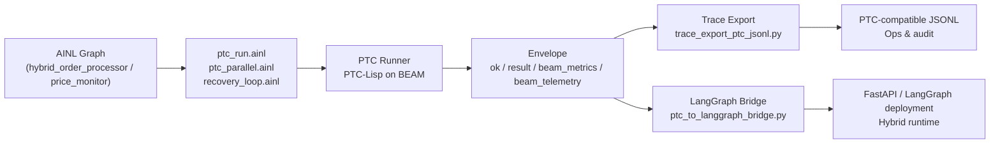

# PTC Runner Adapter (`ptc_runner`)

`ptc_runner` is an optional AINL runtime adapter for executing PTC-Lisp snippets
through an external PTC Runner service.

This integration is additive and opt-in:

- enable with `--enable-adapter ptc_runner`, or
- set `AINL_ENABLE_PTC=true`.

If neither is set, calls are blocked by design.

## Feature summary

- **Adapter**: `ptc_runner` (opt-in, `--enable-adapter ptc_runner` / `AINL_ENABLE_PTC=true`)
- **Execution**: runs PTC-Lisp snippets with optional `signature` + `subagent_budget`
- **Reliability**:
  - signature metadata + `intelligence/signature_enforcer.py`
  - bounded retries via `modules/common/recovery_loop.ainl` (`ok:false` envelope)
  - parallel orchestration via `modules/common/ptc_parallel.ainl` (pcall-style, queue side-channel)
- **Observability**:
  - `health` / `status` verbs + optional BEAM `beam_metrics` passthrough
  - PTC-compatible trace export via `intelligence/trace_export_ptc_jsonl.py` + `scripts/ainl_trace_viewer.py`
  - context firewall audit via `intelligence/context_firewall_audit.py` (`_` keys)
- **Hybrid emission**:
  - LangGraph bridge via `intelligence/ptc_to_langgraph_bridge.py`
  - canonical end-to-end example: [`examples/ptc_integration_example.ainl`](../../examples/ptc_integration_example.ainl)
  - production hybrid examples: [`examples/hybrid_order_processor.ainl`](../../examples/hybrid_order_processor.ainl), [`examples/price_monitor.ainl`](../../examples/price_monitor.ainl)
- **CLI**: `ainl run-hybrid-ptc` — one-command mock-friendly onramp (see `ainl run-hybrid-ptc --help`)

## Syntax

Preferred split form (lowercase verb):

```ainl
R ptc_runner run "(+ 1 2)" "{total :float}" 5 ->out
```

Dotted strict-friendly form:

```ainl
R ptc_runner.RUN "(+ 1 2)" "{total :float}" 5 ->out
```

Arguments:

1. `lisp` (required): PTC-Lisp source string
2. `signature` (optional): expected output signature string
3. `subagent_budget` (optional): integer execution budget

Health/status check (no args):

```ainl
R ptc_runner health ->health
R ptc_runner status ->health
```

## Environment

- `AINL_ENABLE_PTC=true` enables adapter registration without CLI flag.
- `AINL_PTC_RUNNER_URL` sets the HTTP endpoint used for execution.
- `AINL_PTC_RUNNER_MOCK=1` enables deterministic mock mode for testing.
- `AINL_PTC_RUNNER_CMD` optional subprocess fallback command (stdin JSON, stdout JSON).
- `AINL_PTC_METRICS_PATH` optional metrics path (example: `/metrics`) for health checks.

## Security + gating

- Adapter is disabled unless explicitly enabled (`--enable-adapter ptc_runner` or `AINL_ENABLE_PTC=true`).
- Host allowlist restrictions from `--http-allow-host` are respected.
- Calls fail fast when endpoint/config is missing.
- `_`-prefixed context keys are filtered before request serialization (context firewall).

## Result envelope

`ptc_runner` returns a normalized envelope:

```json
{
  "ok": true,
  "runtime": "ptc_runner",
  "status_code": 200,
  "result": {},
  "beam_metrics": {},
  "traces": []
}
```

`traces` is passed through when provided by the runner, so trajectory/intelligence
systems can capture the same execution breadcrumbs.

## Reliability add-ons (Phase 2)

- Optional signature annotation in AINL source comments:
  - `# signature: {total :float}`
- Signature linting appears via `scripts/validate_ainl.py` diagnostics.
- Runtime validation + bounded retry (max 3) are provided by:
  - `intelligence/signature_enforcer.py`

## PTC runner startup notes

AINL calls an existing PTC service endpoint via `AINL_PTC_RUNNER_URL` (HTTP).
If your deployment does not expose HTTP directly, use `AINL_PTC_RUNNER_CMD`
subprocess fallback.

Typical service startup (adjust to your `ptc_runner` install):

```bash
# Example only; use your checked-out ptc_runner launch command.
mix run --no-halt
```

or containerized:

```bash
docker run --rm -p 4000:4000 <your-ptc-runner-image>
```

## Example run

```bash
AINL_ENABLE_PTC=true \
AINL_PTC_RUNNER_URL=http://localhost:4000/run \
python3 -m cli.main run examples/test_adapters_full.ainl \
  --strict \
  --enable-adapter ptc_runner \
  --http-allow-host localhost
```

## Canonical End-to-End Example

This example is copy-paste oriented and keeps everything opt-in:

- uses a subagent-isolation envelope pattern (`namespace`, `budget`, `payload`)
- runs `ptc_runner` with signature metadata
- demonstrates `_` context firewall keys
- validates with `signature_enforcer`
- exports trajectory to PTC-compatible JSONL

### 1) AINL workflow (`examples/ptc_integration_example.ainl`)

```ainl
L1:
  Set subagent_namespace "ptc/orders"
  Set subagent_budget 3
  Set subagent_payload "{\"task\":\"orders\"}"
  X subagent_envelope (obj "namespace" subagent_namespace)
  X subagent_envelope (put subagent_envelope "budget" subagent_budget)
  X subagent_envelope (put subagent_envelope "payload" subagent_payload)

  # Context firewall demo: _internal_token is retained in runtime frame but filtered before outbound adapter serialization.
  Set _internal_token "debug-only-secret"

  R ptc_runner run "(->> (tool/get_orders {:status \"pending\"}) (filter #(> (:amount %) 100)) (sum-by :amount))" "{total :float}" 3 ->ptc_out # signature: {total :float}
  J ptc_out
```

### 2) Run in mock mode (strict + trajectory)

```bash
AINL_PTC_RUNNER_MOCK=1 \
python3 <<'PY'
from pathlib import Path
from runtime.engine import RuntimeEngine
from runtime.adapters.base import AdapterRegistry
from adapters.ptc_runner import PtcRunnerAdapter

code = Path("examples/ptc_integration_example.ainl").read_text()
reg = AdapterRegistry(allowed=["core", "ptc_runner"])
reg.register("ptc_runner", PtcRunnerAdapter(enabled=True))

eng = RuntimeEngine.from_code(
    code,
    strict=True,
    adapters=reg,
    source_path=str(Path("examples/ptc_integration_example.ainl").resolve()),
    trajectory_log_path="/tmp/ainl_ptc_example.jsonl",
)
print(eng.run_label("1"))
PY
```

Expected result shape:

- live runner: `{"ok": true, "result": {"total": <float>}, ...}`
- mock mode (`AINL_PTC_RUNNER_MOCK=1`): deterministic envelope with echoed Lisp payload in `result.value`

### 3) Validate signature metadata and enforce runtime signature checks

```bash
# metadata inspection
python3 intelligence/signature_enforcer.py examples/ptc_integration_example.ainl

# runtime retry helper (bounded max 3 attempts)
AINL_PTC_RUNNER_MOCK=1 \
python3 <<'PY'
from adapters.ptc_runner import PtcRunnerAdapter
from intelligence.signature_enforcer import run_with_signature_retry

print(
    run_with_signature_retry(
        adapter=PtcRunnerAdapter(enabled=True),
        lisp="(->> (tool/get_orders {:status \"pending\"}) (filter #(> (:amount %) 100)) (sum-by :amount))",
        signature="{total :float}",
        max_attempts=3,
    )
)
PY
```

### 4) Export trajectory to PTC-compatible JSONL

```bash
PYTHONPATH=. python3 scripts/ainl_trace_viewer.py /tmp/ainl_ptc_example.jsonl --ptc-export /tmp/ptc_trace.jsonl
```

## Syntactic sugar via `ptc_run.ainl`

For slightly nicer, named frame variables (and cleaner agent-generated code), you can use the thin wrapper module `modules/common/ptc_run.ainl`. It does not change the DSL or parser — it simply normalizes optional fields and delegates to `ptc_runner run`.

```ainl
include modules/common/ptc_run.ainl as ptcrun

L1:
  Set ptc_run_lisp "(->> (tool/get_orders {:status \"pending\"}) (filter #(> (:amount %) 100)) (sum-by :amount))"
  Set ptc_run_signature "{total :float}"
  Set ptc_run_subagent_budget 5
  Call ptcrun/ENTRY ->ptc_out
  J ptc_out
```

Notes:
- `ptc_run_signature` is optional; when omitted or left as the default sentinel, the wrapper passes `null` to `ptc_runner`.
- `ptc_run_subagent_budget` is optional; when omitted, it defaults to `3`.
- Under the hood this is equivalent to `R ptc_runner run <lisp> <signature> <budget> ->ptc_out`.

## Parallel `ptc_runner` Calls (pcall-style)

Use `modules/common/ptc_parallel.ainl` to orchestrate a list of `ptc_runner` calls with an optional inline cap. The module returns a list of `ptc_runner` envelopes (one per executed call).

```ainl
include modules/common/ptc_parallel.ainl as ppar

L1:
  # JSON array string of call objects: [{"lisp":"...","signature":"..."}, ...]
  Set ptc_parallel_calls_json "[{\"lisp\":\"(+ 1 1)\",\"signature\":\"{a :int}\"},{\"lisp\":\"(+ 2 2)\",\"signature\":\"{a :int}\"}]"
  Set ptc_parallel_subagent_budget 3
  Set ptc_parallel_max_concurrent 1
  # Optional side-channel: if non-null, emits one `queue.Put` per scheduled call.
  Set ptc_parallel_queue_name null
  Call ppar/ENTRY ->ptc_parallel_out
  J ptc_parallel_out
```

Notes:
- `ptc_parallel_max_concurrent` caps the inline execution count (best-effort in the default local runtime).
- If you set `ptc_parallel_queue_name`, the module emits a `queue.Put` side-channel so a production worker can fan out externally.

## Recovery Loop (bounded retries via runner validation)

Use `modules/common/recovery_loop.ainl` to wrap a `ptc_runner` call with bounded retries based on the runner's envelope:
- retry while `ok: false`
- stop when `ok: true` or when `ptc_recovery_max_attempts` is reached

```ainl
include modules/common/recovery_loop.ainl as rec

L1:
  Set ptc_recovery_lisp "(->> (tool/get_orders {:status \"pending\"}) (filter #(> (:amount %) 100)) (sum-by :amount))"
  Set ptc_recovery_signature "{total :float}"
  Set ptc_recovery_subagent_budget 3
  Set ptc_recovery_max_attempts 3
  Call rec/ENTRY ->recovered
  J recovered
```

Docs wording (intentionally precise):
- Runtime retry decisions come from the `ptc_runner` failure envelope (`ok:false`).
- `signature` is treated as runner-side validation input (or mock simulation), while `intelligence/signature_enforcer.py` remains available for auditing/diagnostics.

## Ad-hoc `llm_query` inside PTC patterns

`llm_query` is an optional adapter for small ad-hoc prompt calls inside your graph. You can use it to generate/derive the `ptc_runner` `lisp` + `signature` strings without changing the PTC call path.

```ainl
# Enable with: --enable-adapter llm_query (or AINL_ENABLE_LLM_QUERY=true)

R llm_query query "Return only JSON: {\"lisp\": <PTC-Lisp>, \"signature\": <signature>} for task: ... " ->llm_env
X ptc_lisp get llm_env result lisp
X ptc_sig get llm_env result signature
R ptc_runner run ptc_lisp ptc_sig 3 ->ptc_out
J ptc_out
```

Reminder:
- `llm_query` filters `_`-prefixed context keys before request serialization (context firewall).

## LangGraph Emission with PTC

Use the intelligence bridge as a post-processing step (no core emitter changes):

```bash
python3 intelligence/ptc_to_langgraph_bridge.py --source examples/ptc_integration_example.ainl --out /tmp/ptc_langgraph_bridge.py
```

Example generated snippet shape:

```python
from langgraph.graph import StateGraph, END

def create_ptc_tool_node(ptc_client):
    def _node(state):
        out = dict(state.get("ptc_results") or {})
        # ... generated PTC_CALLS loop ...
        return {"ptc_results": out}
    return _node
```

Hybrid workflow:

1. Emit your normal LangGraph artifact as usual.
2. Run `ptc_to_langgraph_bridge.py` from source or trajectory.
3. Import/merge the generated `create_ptc_tool_node(...)` into your emitted graph and attach the bridge node where needed.

Notes:

- The adapter uses PTC Runner HTTP (`AINL_PTC_RUNNER_URL`) when configured, or subprocess fallback (`AINL_PTC_RUNNER_CMD`).
- Signature metadata is comment-based (`# signature: ...`) and intentionally does not require parser/grammar changes.
- `modules/common/subagent_isolated.ainl` and `modules/common/parallel.ainl` remain available as reusable helpers; the canonical CLI-safe flow above inlines the same subagent envelope shape.
- `--enable-adapter ptc_runner` registers the adapter in CLI runs, while capability policy allowlists are enforced separately by the runtime surface in use.

## Deeper BEAM Integration (Subprocess Mode)

By default, `ptc_runner` uses the HTTP endpoint configured via `AINL_PTC_RUNNER_URL`. For hosts that prefer **direct BEAM subprocess execution** (for example, when co-locating the Elixir service with the runtime), you can opt into subprocess mode:

- `AINL_PTC_RUNNER_CMD` — command to invoke the PTC Runner subprocess (reads JSON on stdin, writes JSON on stdout).
- `AINL_PTC_USE_SUBPROCESS=true` — when truthy, `ptc_runner.run` prefers the subprocess path when `AINL_PTC_RUNNER_CMD` is set.

Behavior:

- When mock mode is enabled (`AINL_PTC_RUNNER_MOCK=1`), subprocess/HTTP are bypassed as before.
- When `AINL_PTC_USE_SUBPROCESS=true` and `AINL_PTC_RUNNER_CMD` is set, `run` uses the subprocess path and returns the same high-level envelope:
  - `ok` (bool)
  - `status_code` (subprocess exit code)
  - `result` (parsed JSON body or a structured error when the process fails)
  - `beam_metrics` (normalized heap/reduction/exec-time/pid when present)
  - `beam_telemetry` (optional richer telemetry, passed through when provided)
  - `traces` (unchanged passthrough)
- When `AINL_PTC_USE_SUBPROCESS` is unset and `AINL_PTC_RUNNER_URL` is configured, HTTP remains the default path.

The subprocess mode is **purely opt-in** and does not change existing HTTP or mock behavior. Health/status checks continue to use the HTTP endpoints when configured; subprocess mode only affects the main `run` calls.

## Production Hybrid Examples

### Order Processor

[`examples/hybrid_order_processor.ainl`](../../examples/hybrid_order_processor.ainl) — combines `ptc_parallel.ainl` (fan-out for two order batches), `recovery_loop.ainl` (bounded retries for consolidation), and the `_` context firewall.

```bash
# Mock mode (no real PTC Runner required):
ainl run-hybrid-ptc

# Or manually:
AINL_ENABLE_PTC=true AINL_PTC_RUNNER_MOCK=1 \
python3 -m cli.main run examples/hybrid_order_processor.ainl \
  --enable-adapter ptc_runner --strict=false \
  --http-allow-host localhost \
  --trace-jsonl /tmp/hybrid_orders.trace.jsonl
```

### Price Monitor

[`examples/price_monitor.ainl`](../../examples/price_monitor.ainl) — monitors price symbols from multiple sources, filters large changes, and summarizes with signatures and recovery.

```bash
AINL_ENABLE_PTC=true AINL_PTC_RUNNER_MOCK=1 \
python3 -m cli.main run examples/price_monitor.ainl \
  --enable-adapter ptc_runner --strict=false \
  --http-allow-host localhost \
  --trace-jsonl /tmp/price_monitor.trace.jsonl
```

## AINL ↔ PTC ↔ BEAM ↔ Emission Flow




*Figure: AINL → PTC-Lisp → BEAM → traces and LangGraph emission.*

> To render the PNG from the Mermaid source (optional, for docs builds):
> `mmdc -i docs/assets/ptc_flow.mmd -o docs/assets/ptc_flow.png`

## MCP Tools for PTC

| Tool | Description |
|------|-------------|
| `ainl_ptc_run` | Run a PTC-Lisp snippet via `ptc_runner` from MCP |
| `ainl_ptc_health_check` | Check PTC Runner health/status via MCP |
| `ainl_ptc_signature_check` | Validate `# signature:` metadata in a source file |
| `ainl_trace_export` | Export AINL trajectory to PTC-compatible JSONL |
| `ainl_ptc_audit` | Combined audit: signature enforcement + context firewall check |

These tools are available in the `safe_workflow` and `full` MCP exposure profiles. See `tooling/mcp_exposure_profiles.json` for configuration.
