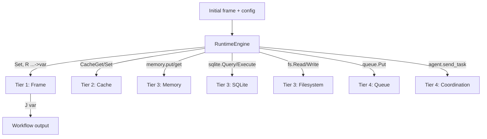

## State Discipline

This document describes AINL's **state model** as a unified, tiered
discipline. AINL workflows manage state through explicit, adapter-mediated
tiers rather than hiding state inside prompt history or ad hoc globals.

This is a docs-only description; it does not change compiler or runtime
semantics.

---

## 1. Why state discipline matters

Agent systems that rely on prompt history for state suffer from:

- growing context windows and rising token costs,
- hidden or implicit state that is hard to inspect or reproduce,
- no clear separation between ephemeral scratch values and durable records,
- scattered conventions across memory, cache, database, and coordination.

AINL addresses this by making state **explicit, tiered, and adapter-mediated**.
Every piece of state lives in a named tier with a defined lifecycle and access
pattern.

---

## 2. State tiers

AINL state is organized into four tiers, from shortest-lived to most durable:

```
┌─────────────────────────────────────────────────────────┐
│  Tier 1: Frame (ephemeral)                              │
│  Variables live for one workflow run                     │
├─────────────────────────────────────────────────────────┤
│  Tier 2: Cache (short-lived)                            │
│  Key-value entries with optional TTL                    │
├─────────────────────────────────────────────────────────┤
│  Tier 3: Persistent storage (durable)                   │
│  Memory records, SQLite tables, filesystem artifacts    │
├─────────────────────────────────────────────────────────┤
│  Tier 4: Coordination (cross-workflow)                  │
│  Agent envelopes, queue messages                        │
└─────────────────────────────────────────────────────────┘
```

### Tier 1: Frame (ephemeral)

The execution frame is a `Dict[str, Any]` that holds variables for a single
workflow run. Variables are created by adapter calls (`R ... ->var`), `Set`
operations, and initial `frame` input. The frame is discarded when the run
completes.

- **Lifetime:** single run
- **Access:** `_resolve(token, frame)` in the runtime engine
- **Limits:** `max_frame_bytes` caps frame size
- **Use when:** you need scratch values, intermediate results, or control-flow
  variables within a single execution

**Implementation:** `runtime/engine.py` (frame dict, `_resolve`, `_guard_tick`
frame-size check), `runtime/values.py` (`deep_get`, `deep_put`, `json_safe`)

### Tier 2: Cache (short-lived)

The cache adapter provides key-value storage with optional TTL. Cache entries
survive across runs within the same runtime instance but are not guaranteed
to persist across restarts.

- **Lifetime:** runtime instance (or TTL-bounded)
- **Access:** `CacheGet` / `CacheSet` ops, or `R cache.Get` / `R cache.Set`
- **Use when:** you need warm data across consecutive runs, cooldown tracking,
  or throttle state

**Implementation:** caller-registered cache adapter; `adapters/mock.py`
(`MockCacheAdapter`) for testing

### Tier 3: Persistent storage (durable)

Durable state that survives runtime restarts and can be exported/imported.

**Memory adapter** — structured records keyed by `(namespace, record_kind,
record_id)` with JSON payloads, timestamps, and optional TTL. Memory is the
**recommended durable state mechanism** for any workflow that needs persistence
beyond a single run. While classified as `extension_openclaw` by packaging
origin, it is the primary persistent state tier for stateful workflows across
all deployment environments (OpenClaw, NemoClaw, custom hosts).

- **Namespaces:** `session`, `long_term`, `daily_log`, `workflow`
- **Verbs:** `put`, `get`, `append`, `list`, `delete`, `prune`
- **Backend:** SQLite (configurable via `AINL_MEMORY_DB`)
- **Bridges:** JSON/JSONL export/import (`tooling/memory_bridge.py`),
  markdown export (`tooling/memory_markdown_bridge.py`)

**Graph memory adapter (`ainl_graph_memory`)** — separate from SQLite **`memory`**: JSON file of typed **nodes/edges** (default `~/.armaraos/ainl_graph_memory.json`), ArmaraOS bridge integration, optional IR ops **`MemoryRecall`** / **`MemorySearch`**, semantic **`EdgeType`** edges, **`persona.update`** persistence. See **[`../adapters/AINL_GRAPH_MEMORY.md`](../adapters/AINL_GRAPH_MEMORY.md)**. **Procedural merge** of stored IR fragments uses the SQLite **`memory`** adapter table **`ainl_memory_patterns`** + engine step **`memory.merge`** — **[`../adapters/MEMORY_CONTRACT.md`](../adapters/MEMORY_CONTRACT.md)** §3.7.

**SQLite adapter** — direct SQL access for structured queries and mutations.

- **Verbs:** `Query` (read-only), `Execute` (write, if `allow_write=True`)
- **Guards:** `allow_tables` allowlist, `allow_write` flag

**Filesystem adapter** — sandboxed file read/write.

- **Verbs:** `Read`, `Write`, `List`, `Delete`
- **Guards:** `sandbox_root`, `allow_extensions`, `max_read_bytes`,
  `max_write_bytes`

**Use when:** you need state that outlives a single run — session context,
long-term facts, daily logs, workflow checkpoints, or structured data.

**Implementation:** `runtime/adapters/memory.py`, `runtime/adapters/sqlite.py`,
`runtime/adapters/fs.py`

### Tier 4: Coordination (cross-workflow)

State that flows between workflows or between agents.

**Queue adapter** — enqueue structured payloads for downstream consumers.

- **Verbs:** `Put`
- **Use when:** a workflow produces output for another workflow or system

**Agent coordination** — file-backed mailbox for `AgentTaskRequest` /
`AgentTaskResult` envelopes.

- **Verbs:** `send_task`, `read_result`
- **Transport:** local JSONL files under `AINL_AGENT_ROOT`
- **Use when:** workflows coordinate with external agents or orchestrators

**Implementation:** `runtime/adapters/` (queue), agent adapter;
`docs/advanced/AGENT_COORDINATION_CONTRACT.md`

---

## 3. Data flow during execution



State flows **downward** through tiers as durability requirements increase.
A typical workflow:

1. Receives input via the initial `frame`
2. Computes intermediate values in **Tier 1** (frame variables)
3. Checks or updates warm state in **Tier 2** (cache)
4. Reads or writes durable records in **Tier 3** (memory, SQLite, filesystem)
5. Emits coordination messages in **Tier 4** (queue, agent envelopes)
6. Returns output from the frame

---

## 4. Choosing the right tier

| Need | Tier | Adapter | Example |
|------|------|---------|---------|
| Scratch computation | Frame | (built-in) | `R core.ADD 2 3 ->sum` |
| Cooldown / throttle | Cache | `cache` | `CacheGet "monitors" "last_run"` |
| Session context | Memory | `memory` | `R memory.put "session" "context" "ctx1" payload` |
| Long-term facts | Memory | `memory` | `R memory.put "long_term" "preference" "theme" payload` |
| Structured queries | SQLite | `sqlite` | `R sqlite.Query "SELECT * FROM metrics"` |
| File artifacts | Filesystem | `fs` | `R fs.Write "/reports/daily.json" content` |
| Downstream handoff | Queue | `queue` | `R queue.Put "alerts" payload` |
| Agent coordination | Agent | `agent` | `R agent.send_task task_envelope` |

---

## 5. State and sandbox profiles

Each sandbox profile (defined in
`docs/operations/SANDBOX_EXECUTION_PROFILE.md`) determines which state tiers
are available:

| Profile | Frame | Cache | Memory | SQLite | FS | Queue | Agent |
|---------|-------|-------|--------|--------|----|-------|-------|
| Minimal | Yes | No | No | No | No | No | No |
| Compute-and-store | Yes | Yes | Yes | Yes | Yes | No | No |
| Network-restricted | Yes | Yes | Yes | Yes | Yes | Yes | No |
| Operator-controlled | Yes | Yes | Yes | Yes | Yes | Yes | Yes |

The frame (Tier 1) is always available. Higher tiers require the corresponding
adapter to be in the allowlist.

---

## 6. State discipline vs prompt-loop state

| Concern | Prompt-loop approach | AINL state discipline |
|---------|---------------------|---------------------|
| Where state lives | Hidden in context window | Explicit tiers with named adapters |
| Inspection | Parse prompt history | Read frame, query memory/cache/DB |
| Reproducibility | Non-deterministic | Record/replay adapter calls |
| Cost | Growing tokens per run | Compile-once, state in adapters |
| Durability | Lost on session end | Tiered: ephemeral to persistent |
| Cross-workflow | Re-inject into next prompt | Queue and coordination envelopes |

---

## 7. Relationship to other docs

- **Memory contract:** `docs/adapters/MEMORY_CONTRACT.md`
- **Adapter registry:** `docs/reference/ADAPTER_REGISTRY.md`
- **Runtime/compiler contract:** `docs/RUNTIME_COMPILER_CONTRACT.md`
- **Sandbox execution profiles:** `docs/operations/SANDBOX_EXECUTION_PROFILE.md`
- **External orchestration guide:** `docs/operations/EXTERNAL_ORCHESTRATION_GUIDE.md`
- **Agent coordination contract:** `docs/advanced/AGENT_COORDINATION_CONTRACT.md`
- **Public article (memory tiers, MCP hosts, OpenClaw bridge vs SQLite `memory`):** [AINL, structured memory, and OpenClaw-style agents](https://ainativelang.com/blog/ainl-structured-memory-openclaw-agents)
