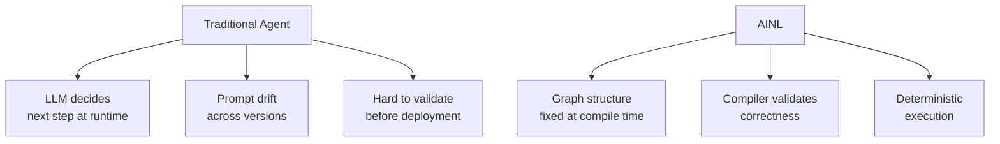

# What is AINL?

**AINL (AI Native Language)** is a programming language designed to build deterministic AI workflows that compile to strict, validated graphs.

## The Problem AINL Solves

Traditional AI agent frameworks (LangGraph, Semantic Kernel, etc.) have issues:

| Problem | Traditional Frameworks | AINL |
|---------|----------------------|------|
| **Prompt drift** | LLM decides behavior at runtime—prompt changes cause unpredictable results | Graph structure is fixed at compile time |
| **Validation** | Manual testing, no guarantee of correctness | Compiler validates graph structure, types, and constraints |
| **Token costs** | Agent loops re-prompt LLM on every step | Deterministic steps avoid unnecessary LLM calls |
| **Observability** | Hard to trace decisions, poor auditability | JSONL execution tapes record every step |
| **Portability** | Framework lock-in | Emit to multiple targets (LangGraph, Temporal, FastAPI, React) |

## Core Concepts

### 1. Graph-First Programming

AINL programs are **directed acyclic graphs (DAGs)** where:

- **Nodes** are actions: LLM calls, tools, HTTP requests, or custom logic
- **Edges** define data flow between nodes
- The entire graph is defined **once** and validated at compile time

```ainl
graph ExampleWorkflow {
  input: UserQuery
  node classify: LLM("classify intent") {
    prompt: "Classify: {{input}}"
  }
  node route: switch(classify.result) {
    case "support" -> support_workflow
    case "sales" -> sales_workflow
    case "technical" -> tech_workflow
  }
  output: route.result
}
```

### 2. Compile-Time Validation

Before running, `ainl validate` checks:

- ✅ All nodes have required inputs
- ✅ No circular dependencies
- ✅ Type correctness (strings, numbers, objects)
- ✅ Resource constraints (token budgets, timeout limits)
- ✅ Security policies (allowed tools, API scopes)

If validation fails, the program **does not run**.

### 3. Deterministic Execution

Once validated, the graph executes **exactly as defined**:

- No LLM re-prompting to "figure out next step"
- No dynamic branching based on LLM whims
- Predictable runtime behavior and token usage

### 4. Emitters: One Graph, Many Targets

AINL compiles to various backends:

| Emitter | Use Case |
|---------|----------|
| `langgraph` | Deploy as LangGraph agent (if you need their ecosystem) |
| `temporal` | Run as Temporal workflow (for durable execution) |
| `fastapi` | Expose as REST API with OpenAPI spec |
| `react` | Generate interactive UI components |
| `openclaw` | Run as Hermes/OpenClaw agent skill |

**Write once, deploy anywhere.**

## Who is AINL For?

### 👨‍💻 Developers
Build AI agents without prompt engineering uncertainty. Validate once, deploy with confidence.

### 🏢 Enterprise Teams
Compliance-ready workflows with audit trails. SOC 2, HIPAA, GDPR alignment.

### 🤖 AI Researchers
Reproducible experiments—same graph, same results every time.

### 🛠️ DevOps / SRE
Monitor, alert, and auto-heal using deterministic pipelines.

## What AINL is NOT

- ❌ A chatbot framework (AINL is for workflows, not conversations)
- ❌ A prompt engineering tool (prompts are part of nodes, not the whole program)
- ❌ Only for LLMs (AINL can use tools, APIs, and custom code)
- ❌ A no-code platform (AINL requires programming, but less than raw framework code)

## Quick Comparison



## Next Steps

Ready to try AINL?

1. **[Install AINL](01-install.md)** – Get the CLI on your machine
2. **[Build Your First Agent](02-first-agent.md)** – 30-minute tutorial
3. **[Validate & Run](03-validate-and-run.md)** – Learn the strict mode workflow

Or **[browse all examples](../examples/basics/)** to see what's possible.

---

**Enterprise?** Skip to [Enterprise Deployment](../learning/enterprise/deployment.md) for hosted runtimes and compliance packages.
