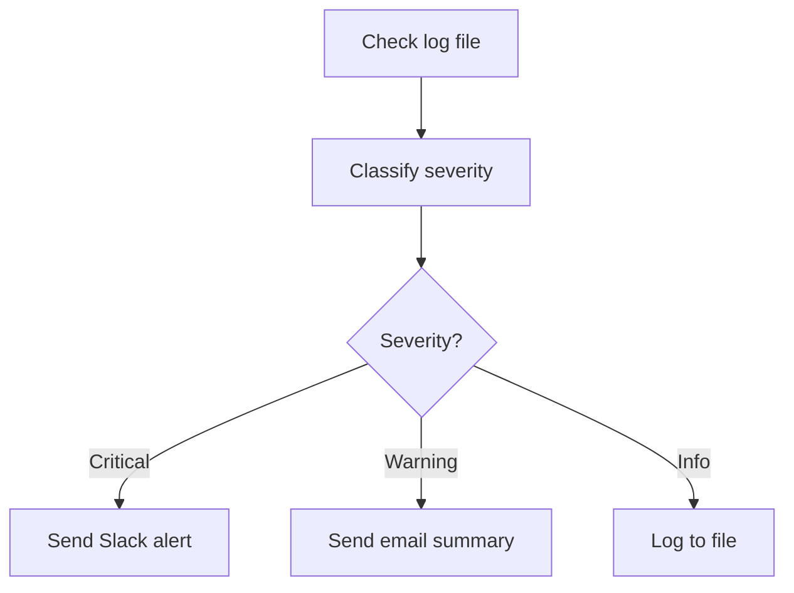

# Build Your First Agent (30-Minute Tutorial)

In this tutorial, you'll build a **monitoring agent** that watches a log file, classifies errors, and sends alerts. This is the same pattern used in production at FinTech Solutions Inc.

## What You'll Build



**Skills after this tutorial:**
- ✅ Create AINL graphs with nodes and edges
- ✅ Use LLM classification with prompt templates
- ✅ Implement conditional routing (switch statements)
- ✅ Validate your graph before running
- ✅ Run with different adapters (OpenRouter, Ollama)

## Prerequisites

- ✅ AINL installed ([verify](01-install.md))
- ✅ OpenRouter API key (or Ollama running locally)
- ✅ Text editor (VS Code, vim, etc.)

---

## Step 1: Project Setup

Create a project directory:

```bash
mkdir ainl-monitor && cd ainl-monitor
```

Create a configuration file `ainl.yaml`:

```yaml
# ainl.yaml
adapter: openrouter
model: openai/gpt-4o-mini
api_key: ${OPENROUTER_API_KEY}  # Set this in your environment

# Optional: set budget limits
budget:
  max_tokens_per_run: 10000
```

Set your API key (in terminal, add to `~/.bashrc` or `~/.zshrc`):

```bash
export OPENROUTER_API_KEY="your-key-here"
```

---

## Step 2: Create the Monitoring Graph

Create `monitor.ainl`:

```ainl
# monitor.ainl - Log monitoring agent

graph Monitor {
  # Input: simulated log entry
  input: LogEntry = {
    timestamp: string
    level: "info" | "warning" | "error" | "critical"
    message: string
    service: string
  }

  # Node 1: Classify the error severity (use LLM)
  node classify: LLM("classify-error") {
    prompt: |
      You are a system monitor. Classify this log entry's severity:
      
      Service: {{input.service}}
      Level: {{input.level}}
      Message: {{input.message}}
      
      Respond with exactly one word: CRITICAL, WARNING, or INFO
    
    model: ${adapter.model}
    max_tokens: 10
  }

  # Node 2: Generate alert message (only if not INFO)
  node alert: LLM("generate-alert") {
    prompt: |
      Write a concise alert for this log:
      
      {{input}}
      
      Severity: {{classify.result}}
      
      Include recommended action.
    
    model: ${adapter.model}
    max_tokens: 200
    # Only run if classify.result != INFO
    when: classify.result != "INFO"
  }

  # Node 3: Route based on severity
  node route: switch(classify.result) {
    case "CRITICAL" -> send_slack
    case "WARNING" -> send_email
    case "INFO" -> log_to_file
  }

  # Node 4a: Send Slack alert
  node send_slack: HTTP("slack-webhook") {
    method: POST
    url: ${env.SLACK_WEBHOOK_URL}
    body: {
      text: "🚨 CRITICAL: {{alert.result}}",
      channel: "#alerts"
    }
  }

  # Node 4b: Send email summary (warning)
  node send_email: HTTP("sendgrid") {
    method: POST
    url: "https://api.sendgrid.com/v3/mail/send"
    headers: {
      Authorization: "Bearer ${env.SENDGRID_API_KEY}"
      "Content-Type": "application/json"
    }
    body: {
      personalizations: [{
        to: [{ email: "ops@example.com" }]
        subject: "⚠️ Warning: {{input.service}}"
      }]
      from: { email: "monitor@example.com" }
      content: [{
        type: "text/plain"
        value: "Warning detected:\n\n{{alert.result}}"
      }]
    }
  }

  # Node 4c: Log to file (info)
  node log_to_file: WriteFile("log-info") {
    path: "./info.log"
    content: "{{input.timestamp}} - {{input.service}} - {{input.message}}"
    mode: append
  }

  # Output: summary of action taken
  output: {
    severity: classify.result
    action_taken: route.result
    alert_sent: alert.result when alert exists else null
  }
}
```

### Key Concepts Illustrated

1. **Graph structure**: `graph Monitor { ... }` defines the workflow
2. **Input schema**: `LogEntry = { ... }` defines typed input
3. **Nodes**: `node name: Type(...) { ... }` - actions with configuration
4. **LLM node**: Uses prompt templates with `{{variable}}` interpolation
5. **Conditional execution**: `when: condition` skips nodes based on runtime values
6. **Switch routing**: `switch(expr) { case -> target }` for branching
7. **Environment variables**: `${env.VAR_NAME}` for secrets
8. **Output**: Structured result from the graph

---

## Step 3: Validate Your Graph

Before running, validate to catch errors:

```bash
ainl validate monitor.ainl
```

**Expected output:**
```
✓ Graph structure valid
✓ All nodes have required inputs
✓ Type schema matches
✓ No circular dependencies
✓ Policy constraints satisfied
```

If validation fails, fix the errors before proceeding.

---

## Step 4: Run the Agent

Create a sample log entry `sample.json`:

```json
{
  "timestamp": "2025-03-30T14:22:15Z",
  "level": "error",
  "message": "Database connection timeout after 30s",
  "service": "payment-processor"
}
```

Run the agent:

```bash
 ainl run monitor.ainl --input sample.json
```

**Expected output:**
```json
{
  "severity": "CRITICAL",
  "action_taken": "send_slack",
  "alert_sent": "🚨 CRITICAL: Alert: Payment processor database..."
}
```

**What just happened:**
1. AINL loaded the graph and input
2. `classify` node called LLM to determine severity → "CRITICAL"
3. `alert` node generated alert message (because CRITICAL != INFO)
4. `route` switch sent execution to `send_slack`
5. Output summarized what happened

---

## Step 5: Experiment with Different Adapters

### Switch to Ollama (Local, Free)

1. Install and run Ollama: <https://ollama.ai>
2. Pull a model: `ollama pull llama3.3:70b`
3. Update `ainl.yaml`:

```yaml
adapter: ollama
model: llama3.3:70b
host: http://localhost:11434
```

4. Re-run: `ainl run monitor.ainl --input sample.json`

**Note**: Local models are slower but free. For production, use OpenRouter or cloud APIs.

---

## Step 6: Make It Production-Ready

### Add Configuration

Create a reusable config `config.ainl`:

```ainl
config {
  adapter: openrouter
  model: openai/gpt-4o-mini
  budget {
    max_tokens_per_run: 5000
    max_cost_per_run_usd: 0.10
  }
  retries: 2
  timeout: 30s
}
```

Import it in your graph: `graph Monitor using config.ainl { ... }`

### Add Health Monitoring

AINL emits a **health envelope** with every run:

```bash
ainl run monitor.ainl --input sample.json --trace-jsonl run.jsonl
```

`run.jsonl` contains:
- Node execution times
- Token usage per node
- Errors and warnings
- Final output

This is your audit trail for compliance.

### Schedule with Cron

```bash
# Run every 5 minutes
crontab -e
# Add:
*/5 * * * * cd /path/to/ainl-monitor && ainl run monitor.ainl --input /var/log/app.log --trace-jsonl /var/log/ainl-runs/$(date +%Y%m%d-%H%M%S).jsonl
```

---

## Step 7: Explore More Examples

Now that you have the basics, try these:

- **[Email monitor](../examples/intermediate/openclaw/EMAIL_MONITOR.md)** – Real production workflow
- **[Data validation](../examples/intermediate/DATA_VALIDATION.md)** – Schema checking with strict mode
- **[Multi-agent coordination](../examples/enterprise/AGENT_COORDINATION.md)** – Complex workflows

---

## What's Next?

Continue to **[Validate & Run](03-validate-and-run.md)** to learn about the strict validation system and how to debug failed runs.

**Already advanced?** Jump to:
- [Adapters](../intermediate/adapters/) for custom LLM integrations
- [Emitters](../intermediate/emitters/) to deploy to LangGraph/Temporal
- [Enterprise Deployment](../enterprise/deployment.md) for hosted runtimes

---

## Need Help?

- **Discussions**: <https://github.com/sbhooley/ainativelang/discussions>
- ** Issues**: <https://github.com/sbhooley/ainativelang/issues>
- **Community Token**: Join the $AINL community for support and rewards
