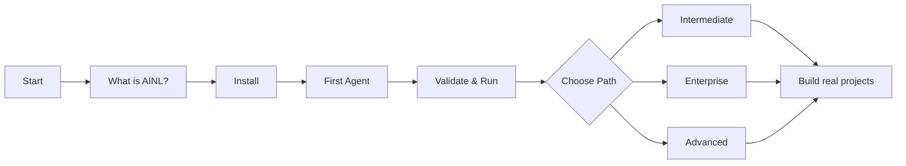

# AINL Basics Learning Path

Welcome! This track gets you from zero to your first working AINL agent in under an hour.

## 🎯 Who This Is For

- New to AINL (first-time users)
- Want to build AI workflows without prompt engineering uncertainty
- Need deterministic, auditable agent behavior
- Prefer code over configuration

**Not for you?** Check other tracks:
- [Enterprise](../enterprise/) – Compliance, SLAs, hosted runtimes
- [Intermediate](../intermediate/) – Adapters, emitters, testing
- [Advanced](../advanced/) – Compiler internals, custom tooling

---

## 📚 What You'll Learn

| Tutorial | Time | Outcome |
|----------|------|---------|
| [00 - What is AINL?](00-what-is-ainl.md) | 10 min | Understand core concepts and when to use AINL |
| [01 - Install AINL](01-install.md) | 10 min | Get CLI working on macOS/Linux/Windows |
| [02 - Build Your First Agent](02-first-agent.md) | 30 min | Create monitoring agent with LLM classification |
| [03 - Validate & Run](03-validate-and-run.md) | 20 min | Master the strict workflow and tracing |
| [04 - Next Steps](04-next-steps.md) | 5 min | Pick your specialization path |

**Total**: ~1.5 hours to AINL proficiency

---

## 🔄 Learning Flow



---

## 💡 Key Concepts Covered

By the end of this path, you'll understand:

✅ **Graph-first programming** – Define workflow structure upfront
✅ **Compile-time validation** – Catch errors before paying for LLM calls
✅ **Deterministic execution** – Same input → same output every time
✅ **Adapters** – Swap LLM providers without changing code
✅ **Execution traces** – Audit logs for compliance and debugging
✅ **Policy enforcement** – Budgets, timeouts, allowed tools

---

## 🛠️ Prerequisites

- Python 3.10+ (`python3 --version`)
- pip (`pip3 --version`)
- Git
- API key from [OpenRouter](https://openrouter.ai) (or run Ollama locally)

---

## 🚀 Quick Start (TL;DR)

```bash
# 1. Install
pip3 install ainl ainl-adapter-openrouter

# 2. Create config
echo "adapter: openrouter\nmodel: openai/gpt-4o-mini" > ainl.yaml

# 3. Build from tutorial
# Follow 02-first-agent.md → create monitor.ainl

# 4. Validate & run
ainl validate monitor.ainl
ainl run monitor.ainl --input sample.json --trace-jsonl run.jsonl

# 🎉 Done!
```

---

## 📖 Tutorial Details

### 00 - What is AINL?

Conceptual introduction. No code required.

- Problem AINL solves (prompt drift, validation gaps, token waste)
- Core concepts (graphs, nodes, edges, compilation)
- Comparison to LangGraph, Temporal, and plain LLM agents
- Who should use AINL

**Duration**: 10 minutes

---

### 01 - Install AINL

Get the CLI and adapters on your machine.

- Platform-specific instructions (macOS, Linux, Windows/WSL)
- Verify installation
- Optional adapters (OpenRouter, Ollama, MCP)
- Troubleshooting common issues

**Duration**: 10 minutes

**Output**: Working `ainl` command

---

### 02 - Build Your First Agent

Hands-on tutorial: build a log monitoring agent.

- Define graph structure with nodes and edges
- Use LLM nodes with prompt templates
- Implement conditional routing (`switch` statements)
- Configure HTTP nodes for Slack/email alerts
- Run with sample input

**Duration**: 30 minutes

**Output**: `monitor.ainl` that classifies errors and sends alerts

---

### 03 - Validate & Run

Deep dive into the strict workflow.

- `ainl validate` checks (syntax, types, policies)
- `ainl run` execution modes
- Execution traces (`--trace-jsonl`) for auditability
- Debugging validation failures
- CI/CD integration patterns

**Duration**: 20 minutes

**Output**: Understanding of validation errors and trace logs

---

### 04 - Next Steps

Choose your specialization path.

- **Developers**: Adapters, emitters, testing
- **Enterprise**: Compliance, security, SLAs
- **Research**: Reproducible experiments, evaluation
- **Community**: Templates, docs, token rewards

**Duration**: 5 minutes to read, lifetime to explore

---

## 🎓 After Basics

You're now ready to specialize:

### For Most Users → [Intermediate Path](../intermediate/README.md)

- Adapters: Connect to databases, queues, APIs
- Emitters: Deploy to LangGraph, Temporal, FastAPI
- Testing: Unit tests, integration tests, mocks
- Monitoring: Health envelopes, dashboards, alerts

### For Business Use → [Enterprise Path](../enterprise/README.md)

- Deploy hosted runtimes or self-host with confidence
- Meet compliance requirements (SOC 2, HIPAA, GDPR)
- Implement security policies and RBAC
- Get SLA-backed support

### For Deep Tech → [Advanced Path](../advanced/README.md)

- Compiler internals and IR optimization
- Custom emitter development
- Latent space analysis
- Performance tuning at scale

---

## 📊 Progress Tracking

We're building a **learning progress badge** system (coming soon):

- Complete each tutorial → unlock next
- Submit working agent → earn "First Agent" badge
- Pass validation challenges → earn "Validation Expert" badge
- Contribute templates → earn $AINL tokens

Watch this space for automated progress tracking via GitHub Discussions.

---

## ❓ Need Help?

- **[Discussions](https://github.com/sbhooley/ainativelang/discussions)** – Ask questions, share projects
- **[Discord](https://discord.gg/ainl)** – Real-time chat with community
- **[Issues](https://github.com/sbhooley/ainativelang/issues)** – Bug reports and feature requests

---

## 🐛 Found a Documentation Bug?

These tutorials are open-source! Fix them:

1. **Fork** <https://github.com/sbhooley/ainativelang>
2. **Edit** this file or create improvements
3. **PR** with your changes (even small fixes help)

Your contribution earns $AINL tokens through our [Token Program](../community/token/).

---

**Ready?** Start with [What is AINL?](00-what-is-ainl.md) →
