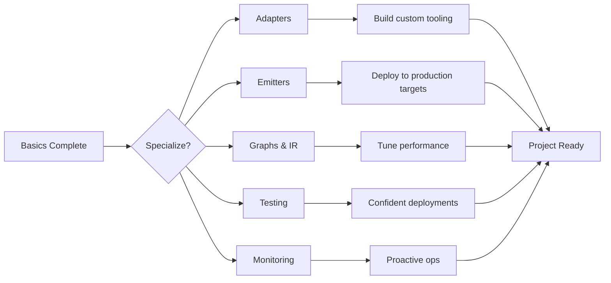

# Intermediate AINL Guide

Welcome! This track builds on the basics to make you productive with real-world AINL deployments.

---

## 🎯 Who This Is For

You've completed the [basics](../basics/) or have equivalent experience:
- ✅ Create graphs with nodes, edges, and switch statements
- ✅ Validate and run graphs with `ainl` CLI
- ✅ Understand execution traces and debugging
- ✅ Configure OpenRouter or Ollama adapters

**What's next:** Scale to production, integrate with your stack, and test thoroughly.

---

## 📚 What You'll Learn

| Topic | Key Skills |
|-------|------------|
| [Adapters](../intermediate/adapters/) | Build custom integrations (DBs, APIs, internal tools) |
| [Emitters](../intermediate/emitters/) | Deploy to LangGraph, Temporal, FastAPI |
| [Graphs & IR](../intermediate/graphs-and-ir.md) | Optimize token usage, understand compilation |
| [Testing](../intermediate/testing.md) | Unit tests, mocks, integration test suites |
| [Monitoring](../intermediate/monitoring.md) | Health envelopes, dashboards, alerting |

---

## 🔄 Learning Flow

---

## 🛠️ When to Use Each Skill

### Need to connect to a database or internal API?
→ [Adapters](../intermediate/adapters/)

### Need to run on Temporal or serve as REST API?
→ [Emitters](../intermediate/emitters/)

### Want to reduce token costs by 20%+?
→ [Graphs & IR](../intermediate/graphs-and-ir.md)

### Need CI/CD and automated testing?
→ [Testing](../intermediate/testing.md)

### Running in production and need observability?
→ [Monitoring](../intermediate/monitoring.md)

---

## 📖 Module Details

### Adapters

AINL's adapter system is how the language talks to the outside world:

- **LLM adapters**: OpenRouter, Ollama, Anthropic (MCP)
- **Tool adapters**: HTTP, SQLite, PostgreSQL, filesystem, custom Python

You'll learn:
- How to write a custom adapter in <50 lines of Python
- Rate limiting, retries, circuit breakers
- Secrets management best practices
- Testing adapters with mocks

**Prerequisite**: Basics (nodes, edges, adapters)

**Time**: 2-3 hours

---

### Emitters

Compile AINL graphs to other workflow engines:

| Emitter | Use Case |
|---------|----------|
| `langgraph` | Use LangGraph's ecosystem while writing AINL |
| `temporal` | Durable, long-running workflows with Docker |
| `fastapi` | Expose graph as REST API with auto-generated docs |
| `react` | Generate interactive UI from graph state |
| `openclaw` | Run as Hermes skill (existing OpenClaw users)

You'll learn:
- Emitter configuration and limitations
- Deploying compiled graphs to target platforms
- Debugging emitter-specific issues
- When to use which emitter

**Prerequisite**: Basics

**Time**: 1-2 hours

---

### Graphs & IR

Understand what happens under the hood:

- Intermediate Representation (IR) format (JSON)
- Graph optimization passes (constant folding, dead code elimination)
- Token estimation at compile time vs runtime
- Performance profiling per node

You'll learn:
- Read and interpret IR
- Identify token waste in graphs
- Apply optimization patterns
- Use `ainl optimize` to automatically simplify graphs

**Prerequisite**: Basics

**Time**: 2 hours

---

### Testing

Move from "works on my machine" to reliable CI/CD:

- Unit testing individual nodes with mocked adapters
- Integration testing entire graphs with sample inputs
- Property-based testing (hypothesis-style)
- CI/CD pipeline examples (GitHub Actions, GitLab CI)

You'll learn:
- Write testable graphs (dependency injection, pure functions)
- Mock external services (HTTP, databases)
- Assert on execution traces
- Fail builds on validation errors or performance regressions

**Prerequisite**: Basics + some testing experience

**Time**: 2-3 hours

---

### Monitoring

Production readiness:

- Health envelopes (structured status output)
- Custom collectors for Prometheus/Grafana
- Alerting strategies (node failures, budget exceedance, SLA holes)
- Grafana dashboard templates

You'll learn:
- Configure `ainl run --health-port` for live metrics
- Parse traces for PagerDuty alerts
- Dashboard graphs for latency, cost, success rate
- Capacity planning and autoscaling triggers

**Prerequisite**: Basics + Grafana/Prometheus familiarity

**Time**: 1-2 hours

---

## 📦 Production Patterns (Optional)

Once you've mastered the core skills, explore **Production Patterns** – real-world, battle-tested templates you can copy and adapt:

### Quick Access Patterns

| Pattern | Time to Implement | Best For |
|---------|-------------------|----------|
| [Email Alert Classifier](patterns/email-alert-classifier.md) | 15 min | Monitoring & alerting |
| [Retry with Backoff](patterns/retry-backoff.md) | 10 min | Resilient API calls |
| [Cache Warmup](patterns/cache-warmup.md) | 20 min | Cost reduction |
| [Data Validation Pipeline](patterns/data-validation-pipeline.md) | 30 min | Data quality |
| [Idempotent Webhook](patterns/idempotent-webhook.md) | 20 min | Webhook handlers |
| [Template Submission](patterns/template-marketplace-submission.md) | – | Contribute your own |

**How to use**: Copy the `.ainl` file into your project, customize configuration, and deploy. Each pattern includes:
- ✅ Complete working graph
- ✅ Configuration guide
- ✅ Testing strategy
- ✅ Production considerations
- ✅ Cost impact analysis

**Earn $AINL**: Submit your own patterns to the [template marketplace](https://github.com/sbhooley/ainativelang/discussions/categories/templates) and earn 5,000–50,000 $AINL per accepted template.

See full pattern index in [patterns/README.md](patterns/README.md).

## 🎯 After Intermediate

You'll be ready to:

- ✅ Build production-ready AINL graphs
- ✅ Integrate with any HTTP-based API or database
- ✅ Deploy to your target platform (Temporal, FastAPI, etc.)
- ✅ Run CI/CD with automated testing
- ✅ Monitor running graphs and set up alerting

From here, choose:
- **[Enterprise Path](../enterprise/)** – Compliance, security, SLAs
- **[Advanced Path](../advanced/)** – Compiler internals, custom emitters, deep optimization

---

## 📂 Example Projects

Need inspiration? Check:

- `examples/intermediate/database-sync.ainl` – Sync Postgres→Elastic with validation
- `examples/intermediate/api-aggregator.ainl` – Funnel 5 microservices into one response
- `examples/intermediate/retry-circuitbreaker.ainl` – Production patterns for unreliable APIs

---

## 🆘 Need Help?

- **Discussions**: `docs/intermediate` category
- **Discord**: `#intermediate-help` channel
- **Issues**: Label `area:intermediate`

---

**Start with: [Adapters](../intermediate/adapters/README.md)** →
