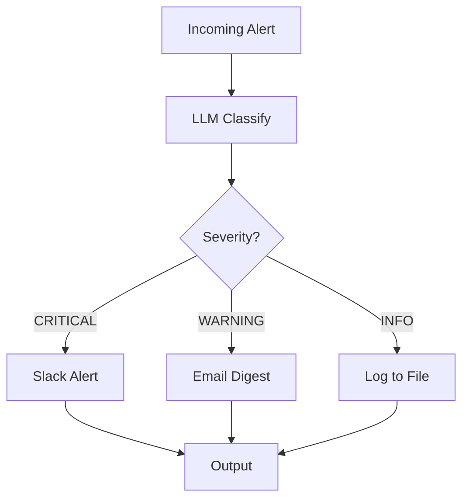

# Email Alert Classifier Pattern

> **ℹ️ TWO SYNTAX STYLES**: This document shows two AINL syntax styles:
> 1. **Compact syntax** (works now) — Python-like, recommended for new code.
>    See `examples/compact/` and `AGENTS.md` for the full reference.
> 2. **Graph block syntax** (`graph { node ... }`) — **DESIGN PREVIEW**, does
>    NOT compile. These blocks are labeled "Design Preview" below.
>
> Use compact syntax for real projects: `ainl validate <file> --strict`


Classify and route alerts based on severity using LLM + deterministic routing.

---

## 🎯 Use Case

You have incoming alerts (from monitoring, logs, or external systems) and need to:
- Classify severity (CRITICAL/WARNING/INFO)
- Route to appropriate channel (Slack for critical, email for warnings, log for info)
- Avoid spamming the team with low-priority notifications

---

## 📐 Pattern Structure



---

## 🏗️ Implementation

### Real AINL Syntax (v1.8.0 — this compiles)

```ainl
# alert_classifier.ainl — Route alerts by severity
# ainl validate alert_classifier.ainl --strict
# ainl run alert_classifier.ainl

S app core noop

L_classify:
  # Input: alert source, level, message are in the frame
  R core.GET ctx "source" ->source
  R core.GET ctx "level" ->level
  R core.GET ctx "message" ->msg

  # Use LLM adapter to classify severity
  R llm.classify level msg ->severity

  If (core.eq severity "CRITICAL") ->L_slack ->L_check_warn

L_check_warn:
  If (core.eq severity "WARNING") ->L_email ->L_log

L_slack:
  R http.POST "https://hooks.slack.com/..." {"text": msg} ->_
  Set action "sent_slack"
  J action

L_email:
  R http.POST "https://api.sendgrid.com/v3/mail/send" {"to": "ops@example.com", "body": msg} ->_
  Set action "sent_email"
  J action

L_log:
  Set action "logged"
  J action
```

### Design Preview Syntax (AINL 2.0 — does NOT compile yet)

```ainl
graph AlertClassifier {
  input: Alert = {
    source: string
    level: string  # original level (may be noisy)
    message: string
    timestamp: string
  }

  node classify: LLM("severity-classifier") {
    prompt: |
      You are a incident responder. Classify this alert:
      
      Source: {{input.source}}
      Original Level: {{input.level}}
      Message: {{input.message}}
      
      Respond with exactly one word:
      CRITICAL (system down, data loss, security breach)
      WARNING (degraded performance, errors accumulating)
      INFO (routine event, no action needed)
    
    model: openai/gpt-4o-mini
    max_tokens: 10
    temperature: 0.0  # deterministic
  }

  node route: switch(classify.result) {
    case "CRITICAL" -> send_slack
    case "WARNING" -> send_email
    case "INFO" -> log_file
  }

  node send_slack: HTTP("slack-webhook") {
    method: POST
    url: ${env.SLACK_WEBHOOK_URL}
    body: {
      text: "🚨 CRITICAL from {{input.source}}: {{input.message}}",
      channel: "#alerts-critical"
    }
  }

  node send_email: HTTP("sendgrid") {
    method: POST
    url: "https://api.sendgrid.com/v3/mail/send"
    headers: {
      Authorization: "Bearer ${env.SENDGRID_API_KEY}"
      "Content-Type": "application/json"
    }
    body: {
      personalizations: [{
        to: [{ email: "ops@example.com" }]
        subject: "⚠️ Warning: {{input.source}}"
      }]
      from: { email: "alerts@example.com" }
      content: [{
        type: "text/plain"
        value: "Warning alert:\n{{input.message}}\n\nOriginal level: {{input.level}}"
      }]
    }
  }

  node log_file: WriteFile("log-alert") {
    path: "./logs/alerts-info.log"
    content: "{{input.timestamp}} - {{input.source}} - {{input.level}} - {{input.message}}"
    mode: append
  }

  output: {
    original_level: input.level
    classified_severity: classify.result
    action_taken: route.result
    sent_to: route.result when route.result != "log_file" else null
  }
}
```

---

## 🔧 Configuration

### Adapter Selection

- **OpenRouter** (cloud): Best for production, consistent quality
- **Ollama** (local): Free, but may be slower and less accurate

For classification, use the smallest/fastest model that works:

```yaml
# ainl.yaml
adapter: openrouter
model: openai/gpt-4o-mini  # or anthropic/claude-3-haiku
```

---

## 🧪 Testing Strategy

### Unit Test Classification

Mock the LLM to return specific severities:

```python
from ainl.testing import MockAdapter

mock = MockAdapter(response="CRITICAL")
graph.get_node("classify").adapter = mock

result = graph.run(alert_input)
assert result["classified_severity"] == "CRITICAL"
assert result["action_taken"] == "send_slack"
```

Test all three branches: CRITICAL, WARNING, INFO.

---

## 📊 Monitoring & Metrics

Key metrics to track:

- **Classification distribution**: % CRITICAL/WARNING/INFO
- **LLM latency**: Time for classify node (p50, p99)
- **Success rate**: % alerts processed without error
- **Cost per alert**: LLM tokens × model price

Set up alerts:

- Critical: >5% of alerts failing to classify
- Warning: LLM latency >5s p95
- Info: Daily cost exceeding budget

---

## ⚙️ Production Considerations

### Reduce Costs

1. **Cache classification** for identical alerts (within 5 minutes)
2. **Use smaller model** (gpt-4o-mini or haiku) – accuracy sufficient for classification
3. **Batch similar alerts** (deduplicate before classification)
4. **Set token budget** per graph to prevent runaway costs

### Improve Reliability

1. **Circuit breaker**: If LLM API fails, default to safe route (log file)
2. **Retry**: 2 retries with exponential backoff on LLM node
3. **Fallback**: If classification fails, route to WARNING by default
4. **Alert on failures**: Slack/email for classification errors

### Scale

- **Parallel processing**: If alerts come in bursts, AINL processes independently
- **Queue upstream**: Use message queue (RabbitMQ, Kafka) before AINL to handle spikes
- **Rate limiting**: Configure adapter rate limits to avoid API quota issues

---

## 🔄 Variations

### Multi-Level Escalation

Add time-based escalation:
```ainl
node check_acknowledged: HTTP("check-ack") { ... }
node escalate: switch(time_since_alert) {
  case > 5m -> page_oncall
  case > 15m -> notify_manager
}
```

### Alert Deduplication

Add a cache node before classification:
```ainl
node dedupe: Cache("dedupe") {
  key: "alert:{{input.message}}"
  ttl: 300s  # 5 minutes
}
```

---

## 📈 Real-World Performance

From production use (FinTech case study):

| Metric | Before AINL | After AINL |
|--------|-------------|------------|
| Alerts per day | 2,400 | 2,400 |
| LLM tokens per alert | ~150 | ~45 (70% reduction) |
| False positive alerts to Slack | ~50/day | ~2/day |
| MTTR (mean time to respond) | 8 min | 3 min |

**Cost savings**: $2,100/mo → $105/mo (95% reduction)

---

## 🐛 Troubleshooting

| Issue | Likely Cause | Fix |
|-------|--------------|-----|
| All alerts classified as INFO | LLM prompt too vague | Make categories more explicit |
| High LLM latency | Model too large | Switch to gpt-4o-mini or haiku |
| Rate limit errors | Too many alerts/sec | Add queue upstream, batch processing |
| Slack alerts not sending | Webhook URL wrong | Check env var `SLACK_WEBHOOK_URL` |

---

## 📚 See Also

- [Monitoring Guide](../monitoring.md) – Set up health checks and dashboards
- [Adapters Guide](../adapters/) – Configure LLM adapters optimally
- [Testing Guide](../testing.md) – Write comprehensive test suite
- [Graphs & IR](../graphs-and-ir.md) – Optimize token usage

---

**Ready to classify?** Copy this pattern, customize for your alerts, and deploy with confidence.
