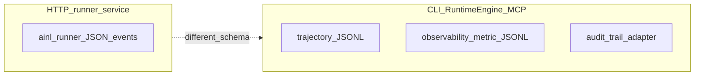

# Audit and telemetry surfaces (AINL)

Single entry point for **which JSONL or structured logs exist**, **where they are emitted**, and **how to enable them**. This map is documentation-only: it does not change runtime behavior.

**AINL is not SOC 2 certified.** SOC 2 is an organizational attestation. In-repo materials such as [`../enterprise/SOC2_CHECKLIST.md`](../enterprise/SOC2_CHECKLIST.md) and [`AINL_SOC2_CONTROL_MAPPING.md`](AINL_SOC2_CONTROL_MAPPING.md) help **operators map** controls to shipped behaviors (logs, strict compile, policy). They are not legal advice and do not imply certification.

## Quick decision table

| You need… | Use this surface | Primary doc / code |
|-----------|------------------|-------------------|
| Structured events for **`/run`** / **`/enqueue`** on the **HTTP runner service** (`ainl-runner-service`) | Runner JSON audit (`ainl.runner` logger) | [`AUDIT_LOGGING.md`](AUDIT_LOGGING.md) · `scripts/runtime_runner_service.py` |
| **Per-step execution JSONL** from **`ainl run`** / `RuntimeEngine` (CLI, tests, MCP host) | CLI trajectory JSONL | [`../trajectory.md`](../trajectory.md) · `cli/main.py` → `trajectory_log_path` |
| **App-authored** append-only events from inside a graph | `audit_trail` adapter | [`../tutorials/production_with_estimates_and_audit.md`](../tutorials/production_with_estimates_and_audit.md) · `adapters/audit_trail.py` |
| **Counters / metrics** (Prometheus collector + optional JSONL lines) | Runtime observability | `runtime/observability.py` · env `AINL_OBSERVABILITY`, `AINL_OBSERVABILITY_JSONL` |

These surfaces use **different schemas** and **different enablement paths**. Do not assume one replaces another.

## CLI trajectory: one engine sink, two ways to enable it

`RuntimeEngine` accepts a single trajectory log path. The CLI sets it from either:

1. **`ainl run … --trace-jsonl PATH`** — write JSONL to `PATH`, or **`-`** for stdout.
2. **`ainl run … --log-trajectory`** or **`AINL_LOG_TRAJECTORY=1`** (etc.) — write to `<source-stem>.trajectory.jsonl` next to the `.ainl` source file.

If both are applicable, **`--trace-jsonl` wins** (see `cli/main.py`). Semantics and line shape are the trajectory format documented in [`../trajectory.md`](../trajectory.md)—not the HTTP runner audit schema in [`AUDIT_LOGGING.md`](AUDIT_LOGGING.md).

## Runner HTTP audit vs embedding

- **Runner service:** emits structured JSON events (`run_start`, `adapter_call`, `run_complete`, `run_failed`, `policy_rejected`) on the `ainl.runner` logger. See [`AUDIT_LOGGING.md`](AUDIT_LOGGING.md).
- **Embedded `RuntimeEngine`** (CLI `ainl run`, MCP `ainl_run`, tests): does **not** emit that schema **unless** you wrap execution with a layer that forwards or re-emits runner-style events.

## What is not a shipped product surface

The following are listed under **`aspirational_not_built`** in **[`STATUS.yaml`](../../STATUS.yaml)** (honesty contract for the repo):

- **`validation_saas_dashboard`** — cloud-hosted validation with compliance reports (not deployed as a product).
- **`hosted_runtime_saas`** — managed execution environment (design only).
- Related marketplace / token-gating entries — see `STATUS.yaml` for current keys.

Local **`ainl serve`** validation/compile/run endpoints exist; they are **not** the same as a hosted compliance dashboard.

## Integrity check (CLI)

For JSONL files containing **`audit_trail`** adapter lines (`event_hash` per record):

```bash
ainl audit verify-jsonl path/to/audit.jsonl
```

Other JSON objects on the same stream (e.g. trajectory lines) are **skipped**. See [`../enterprise/EVIDENCE_BUNDLE_RECIPE.md`](../enterprise/EVIDENCE_BUNDLE_RECIPE.md).

## Related documentation

- **Runner audit schema:** [`AUDIT_LOGGING.md`](AUDIT_LOGGING.md)
- **CLI trajectory:** [`../trajectory.md`](../trajectory.md)
- **Cost estimates + `audit_trail` adapter:** [`../tutorials/production_with_estimates_and_audit.md`](../tutorials/production_with_estimates_and_audit.md)
- **Operator SOC 2 checklist:** [`../enterprise/SOC2_CHECKLIST.md`](../enterprise/SOC2_CHECKLIST.md)
- **TSC-style shared responsibility mapping:** [`AINL_SOC2_CONTROL_MAPPING.md`](AINL_SOC2_CONTROL_MAPPING.md)
- **Repo reality vs design:** [`../../STATUS.yaml`](../../STATUS.yaml)
- **RFC (design only):** optional runner-shaped audit from embedded runs — [`EMBEDDED_RUNNER_AUDIT_BRIDGE.md`](EMBEDDED_RUNNER_AUDIT_BRIDGE.md)

## Diagram (relationships)


